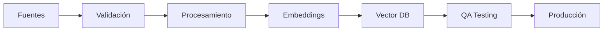

# 🚰 Estrategia de Evolución: Boorie - Cliente IA para Ingenieros Hidráulicos

## 📋 Resumen Ejecutivo

Este documento define la estrategia integral para transformar Boorie de un cliente de IA general a una plataforma especializada para ingenieros hidráulicos. La visión es crear el primer asistente de IA comprehensivo que integre conocimiento técnico hidráulico, normativas regionales, mejores prácticas de la industria y capacidades de modelado con WNTR.

### Objetivos Principales
1. **Especialización Técnica**: Integrar conocimiento hidráulico profundo mediante RAG
2. **Contexto Regional**: Soporte multi-normativa para Latinoamérica, Europa y otros mercados
3. **Herramientas Integradas**: Conexión directa con WNTR para análisis y modelado
4. **Asistencia Inteligente**: IA que comprende el contexto de proyectos hidráulicos
5. **Colaboración**: Facilitar trabajo en equipo en proyectos de agua

## 🎯 Visión del Producto

### De Cliente General a Especialista Hidráulico

**Estado Actual**: Cliente de IA multi-propósito con capacidades de chat
**Estado Objetivo**: Asistente especializado que entiende:
- Cálculos hidráulicos y diseño de redes
- Normativas específicas por región
- Análisis con WNTR integrado
- Gestión de proyectos de agua
- Optimización de sistemas hidráulicos

## 🏗️ Arquitectura Propuesta

### 1. Capa de Conocimiento Especializado (RAG)

```
┌─────────────────────────────────────────────────────────┐
│                   RAG Knowledge Base                      │
├─────────────┬──────────────┬────────────────────────────┤
│  Hydraulics │  Regulations │     Best Practices         │
├─────────────┼──────────────┼────────────────────────────┤
│ • Formulas  │ • By Country │ • Design Guidelines        │
│ • Equations │ • Standards  │ • Operation Methods        │
│ • Methods   │ • Compliance │ • Case Studies             │
│ • WNTR Docs │ • Updates    │ • Efficiency Strategies    │
└─────────────┴──────────────┴────────────────────────────┘
```

### 2. Motor de Procesamiento Contextual

```typescript
interface HydraulicContext {
  projectType: 'design' | 'analysis' | 'optimization' | 'troubleshooting'
  networkType: 'distribution' | 'transmission' | 'collection'
  region: string
  regulations: string[]
  components: ComponentType[]
  constraints: Constraint[]
}
```

### 3. Integración WNTR

```python
# Capacidades WNTR integradas
- Crear y modificar modelos de red
- Ejecutar simulaciones hidráulicas
- Análisis de calidad del agua
- Evaluación de resiliencia
- Optimización de diseño
- Generación de reportes
```

### 4. Asistentes Especializados por Fase

1. **Asistente de Diseño**
   - Dimensionamiento de tuberías
   - Selección de bombas
   - Diseño de tanques
   - Optimización de trazado

2. **Asistente de Análisis**
   - Diagnóstico de problemas
   - Análisis de pérdidas
   - Evaluación de presiones
   - Calidad del agua

3. **Asistente Normativo**
   - Verificación de cumplimiento
   - Alertas de actualizaciones
   - Comparación entre regiones
   - Documentación requerida

4. **Asistente de Operación**
   - Estrategias operacionales
   - Mantenimiento preventivo
   - Gestión de emergencias
   - Eficiencia energética

## 📊 Componentes Técnicos a Implementar

### 1. Sistema RAG Especializado

**Tecnologías**:
- Vector Database: Pinecone/Weaviate/Chroma
- Embeddings: OpenAI Ada-002 o modelo específico para español técnico
- Chunking Strategy: Optimizado para documentos técnicos
- Retrieval: Híbrido (semántico + keyword)

**Implementación**:
```typescript
// Estructura de documento RAG
interface HydraulicDocument {
  id: string
  category: 'hydraulics' | 'regulations' | 'best-practices'
  subcategory: string
  region: string[]
  content: string
  metadata: {
    formulas?: Formula[]
    tables?: Table[]
    figures?: Figure[]
    examples?: Example[]
    references: Reference[]
  }
  embeddings: number[]
  keywords: string[]
  lastUpdated: Date
  version: string
}
```

### 2. Procesador de Contexto Hidráulico

```typescript
class HydraulicContextProcessor {
  // Identifica el tipo de consulta
  async classifyQuery(query: string): Promise<QueryType> {
    // Clasificación usando LLM fine-tuned o few-shot
  }
  
  // Extrae parámetros técnicos
  async extractParameters(query: string): Promise<TechnicalParams> {
    // NER especializado para términos hidráulicos
  }
  
  // Determina normativas aplicables
  async identifyRegulations(context: HydraulicContext): Promise<Regulation[]> {
    // Basado en región y tipo de proyecto
  }
}
```

### 3. Integración WNTR

```typescript
interface WNTRIntegration {
  // Creación de modelos desde descripción en lenguaje natural
  createModelFromDescription(description: string): WNTRModel
  
  // Ejecución de análisis guiados
  runGuidedAnalysis(model: WNTRModel, analysisType: AnalysisType): AnalysisResult
  
  // Interpretación de resultados
  interpretResults(results: AnalysisResult, context: HydraulicContext): Interpretation
  
  // Generación de recomendaciones
  generateRecommendations(interpretation: Interpretation): Recommendation[]
}
```

### 4. Motor de Cálculos Hidráulicos

```typescript
class HydraulicCalculationEngine {
  // Biblioteca de fórmulas
  formulas: Map<string, Formula>
  
  // Ejecución de cálculos con unidades
  calculate(formula: string, params: Parameters): CalculationResult
  
  // Validación de rangos típicos
  validateResult(result: CalculationResult): ValidationResult
  
  // Sugerencias de optimización
  suggestOptimizations(result: CalculationResult): Optimization[]
}
```

### 5. Gestor de Proyectos Hidráulicos

```typescript
interface HydraulicProject {
  id: string
  name: string
  type: ProjectType
  location: Location
  regulations: Regulation[]
  network: WNTRModel
  documents: Document[]
  calculations: Calculation[]
  timeline: Timeline
  team: TeamMember[]
  status: ProjectStatus
}
```

## 🚀 Roadmap de Implementación

### Fase 1: Fundación RAG (Mes 1-2)

**Objetivo**: Establecer la base de conocimiento y sistema RAG

1. **Configuración de Infraestructura RAG**
   - [ ] Seleccionar e implementar vector database
   - [ ] Configurar pipeline de procesamiento de documentos
   - [ ] Implementar estrategia de chunking para docs técnicos
   - [ ] Desarrollar sistema de embeddings optimizado

2. **Carga Inicial de Conocimiento**
   - [ ] Procesar documentación hidráulica fundamental
   - [ ] Cargar normativas prioritarias (México, Colombia, España)
   - [ ] Integrar mejores prácticas esenciales
   - [ ] Documentación WNTR completa

3. **Validación de Calidad**
   - [ ] Pruebas de retrieval con consultas típicas
   - [ ] Validación con ingenieros hidráulicos
   - [ ] Ajuste de parámetros de búsqueda

### Fase 2: Especialización de IA (Mes 2-3)

**Objetivo**: Adaptar los modelos de IA al dominio hidráulico

1. **Fine-tuning de Modelos**
   - [ ] Crear dataset de conversaciones hidráulicas
   - [ ] Fine-tune para comprensión de términos técnicos
   - [ ] Entrenamiento en interpretación de fórmulas
   - [ ] Optimización para español técnico

2. **Procesamiento de Contexto**
   - [ ] Desarrollar clasificador de consultas
   - [ ] Implementar extractor de parámetros técnicos
   - [ ] Sistema de identificación de normativas
   - [ ] Manejo de unidades y conversiones

3. **Prompts Especializados**
   - [ ] Biblioteca de prompts por tipo de tarea
   - [ ] Templates para diferentes fases de proyecto
   - [ ] Prompts multi-idioma (ES/EN/PT)

### Fase 3: Integración WNTR (Mes 3-4)

**Objetivo**: Conectar capacidades de modelado y análisis

1. **Interfaz WNTR-LLM**
   - [ ] API para creación de modelos desde texto
   - [ ] Intérprete de comandos WNTR naturales
   - [ ] Visualización de resultados integrada
   - [ ] Exportación a formatos estándar

2. **Asistente de Modelado**
   - [ ] Guías paso a paso para crear modelos
   - [ ] Validación automática de modelos
   - [ ] Sugerencias de mejora
   - [ ] Comparación con estándares

3. **Análisis Inteligente**
   - [ ] Interpretación automática de resultados
   - [ ] Identificación de problemas comunes
   - [ ] Recomendaciones basadas en best practices
   - [ ] Generación de reportes

### Fase 4: Herramientas Especializadas (Mes 4-5)

**Objetivo**: Desarrollar calculadoras y herramientas específicas

1. **Calculadoras Hidráulicas**
   - [ ] Pérdidas de carga (Darcy-Weisbach, Hazen-Williams)
   - [ ] Golpe de ariete
   - [ ] Dimensionamiento de bombas
   - [ ] Volumen de tanques
   - [ ] Tiempo de retención

2. **Generadores de Documentos**
   - [ ] Memorias de cálculo
   - [ ] Especificaciones técnicas
   - [ ] Reportes de cumplimiento normativo
   - [ ] Planos esquemáticos básicos

3. **Validadores**
   - [ ] Verificador de diseño vs normativa
   - [ ] Analizador de eficiencia
   - [ ] Detector de problemas potenciales

### Fase 5: Colaboración y Proyectos (Mes 5-6)

**Objetivo**: Habilitar trabajo en equipo y gestión de proyectos

1. **Sistema de Proyectos**
   - [ ] Crear/gestionar proyectos hidráulicos
   - [ ] Compartir modelos y análisis
   - [ ] Control de versiones de diseños
   - [ ] Integración con herramientas existentes

2. **Colaboración en Tiempo Real**
   - [ ] Comentarios en modelos
   - [ ] Revisión de diseños
   - [ ] Asignación de tareas
   - [ ] Notificaciones inteligentes

3. **Base de Conocimiento Compartida**
   - [ ] Lecciones aprendidas por proyecto
   - [ ] Biblioteca de componentes reutilizables
   - [ ] Casos de éxito documentados

## 🔧 Configuración Técnica Detallada

### 1. Modificaciones al Cliente Actual

**Frontend (React)**:
```typescript
// Nuevos componentes necesarios
- HydraulicProjectPanel    // Gestión de proyectos
- WNTRModelViewer          // Visualización de redes
- CalculatorPanel          // Calculadoras hidráulicas
- RegulationChecker        // Verificador normativo
- FormulaEditor           // Editor de fórmulas con preview
- NetworkDiagram          // Diagramas interactivos
```

**Backend (Electron)**:
```typescript
// Nuevos handlers IPC
- hydraulicCalculations.handler.ts
- wntrIntegration.handler.ts  
- projectManagement.handler.ts
- regulationCompliance.handler.ts
```

### 2. Estructura de Base de Datos Ampliada

```prisma
// Nuevos modelos para Prisma

model HydraulicProject {
  id            String   @id @default(cuid())
  name          String
  description   String?
  type          String   // design, analysis, optimization
  location      Json     // GeoJSON
  regulations   String[] // IDs de regulaciones aplicables
  wntrModel     Json?    // Modelo WNTR serializado
  calculations  Calculation[]
  documents     ProjectDocument[]
  team          ProjectMember[]
  createdAt     DateTime @default(now())
  updatedAt     DateTime @updatedAt
}

model Calculation {
  id          String   @id @default(cuid())
  projectId   String
  project     HydraulicProject @relation(fields: [projectId], references: [id])
  type        String   // pipe_sizing, pump_selection, etc
  inputs      Json
  results     Json
  formulas    String[]
  verified    Boolean  @default(false)
  createdAt   DateTime @default(now())
}

model ProjectDocument {
  id          String   @id @default(cuid())
  projectId   String
  project     HydraulicProject @relation(fields: [projectId], references: [id])
  type        String   // memory, report, plan, specification
  content     String
  metadata    Json
  version     String
  createdAt   DateTime @default(now())
}
```

### 3. Integración de APIs Externas

```typescript
// Servicios externos a integrar

interface ExternalServices {
  // Datos meteorológicos para diseño
  weatherAPI: {
    getHistoricalRainfall(location: Coordinates, years: number): RainfallData
    getDesignStorm(location: Coordinates, returnPeriod: number): StormData
  }
  
  // Catálogos de fabricantes
  manufacturerAPIs: {
    getPumpCurves(manufacturer: string, model: string): PumpCurve
    getPipeSpecifications(material: string, diameter: number): PipeSpec
  }
  
  // Servicios GIS
  gisServices: {
    getElevationProfile(path: Coordinates[]): ElevationData
    getUrbanDensity(polygon: Polygon): DensityMap
  }
}
```

## 📚 Gestión del Conocimiento

### 1. Pipeline de Actualización Continua



### 2. Métricas de Calidad

- **Cobertura**: % de temas hidráulicos cubiertos
- **Actualidad**: Edad promedio de documentos
- **Relevancia**: Click-through rate en resultados
- **Precisión**: Validación por expertos
- **Uso**: Consultas por categoría

### 3. Proceso de Contribución

1. **Identificación de Gaps**
   - Análisis de consultas sin respuesta
   - Feedback de usuarios
   - Actualizaciones normativas

2. **Creación de Contenido**
   - Asignación a expertos
   - Revisión por pares
   - Validación técnica

3. **Integración**
   - Procesamiento RAG
   - Testing de retrieval
   - Despliegue gradual

## 🎨 Experiencia de Usuario Especializada

### 1. Flujos de Trabajo Optimizados

**Diseño de Red Nueva**:
1. Describir requerimientos en lenguaje natural
2. IA sugiere configuración inicial
3. Refinamiento interactivo con WNTR
4. Validación normativa automática
5. Generación de documentación

**Análisis de Red Existente**:
1. Cargar modelo o describir red
2. Seleccionar tipo de análisis
3. IA ejecuta y interpreta resultados
4. Identificación de problemas
5. Recomendaciones priorizadas

### 2. Interfaces Contextuales

```typescript
// Modos de interfaz según contexto
interface UIMode {
  design: {
    tools: ['network_builder', 'calculator', 'specification_generator']
    layout: 'canvas_focused'
    quickAccess: ['materials', 'standards', 'typical_values']
  }
  
  analysis: {
    tools: ['model_viewer', 'result_charts', 'problem_identifier']  
    layout: 'dashboard'
    quickAccess: ['scenarios', 'comparisons', 'reports']
  }
  
  compliance: {
    tools: ['regulation_checker', 'document_generator', 'checklist']
    layout: 'document_focused'
    quickAccess: ['applicable_norms', 'requirements', 'examples']
  }
}
```

### 3. Asistencia Proactiva

- Detección de errores comunes en diseño
- Sugerencias basadas en proyectos similares
- Alertas de cambios normativos relevantes
- Optimizaciones automáticas opcionales

## 🌍 Estrategia de Localización

### Prioridad por Región

1. **Tier 1** (Lanzamiento): México, Colombia, España
2. **Tier 2** (3 meses): Chile, Argentina, Perú, Portugal
3. **Tier 3** (6 meses): Brasil, USA (estados hispanos), Centroamérica

### Adaptaciones por País

- Normativas específicas
- Terminología local
- Unidades preferidas
- Prácticas constructivas
- Proveedores locales

## 📈 Métricas de Éxito

### KPIs Técnicos
- Precisión de respuestas: >95%
- Tiempo de respuesta: <2s
- Disponibilidad: 99.9%
- Cobertura normativa: 100% países objetivo

### KPIs de Negocio
- Usuarios activos mensuales
- Proyectos creados
- Cálculos realizados
- Satisfacción del usuario (NPS)
- Retención a 6 meses

### KPIs de Impacto
- Tiempo ahorrado por proyecto
- Errores evitados
- Cumplimiento normativo mejorado
- Eficiencia de diseños

## 🔐 Consideraciones de Seguridad y Privacidad

### Datos Sensibles
- Encriptación de proyectos
- Control de acceso granular
- Auditoría de acciones
- Cumplimiento GDPR/LGPD

### Propiedad Intelectual
- Separación clara de conocimiento público/privado
- Licenciamiento de contenido
- Protección de diseños propietarios

## 🚀 Plan de Lanzamiento

### Beta Privada (Mes 6)
- 50 ingenieros seleccionados
- Proyectos piloto reales
- Feedback intensivo
- Iteración rápida

### Beta Pública (Mes 7)
- 500 usuarios
- Documentación completa
- Soporte comunitario
- Programa de embajadores

### Lanzamiento General (Mes 8)
- Marketing dirigido
- Partnerships con colegios de ingenieros
- Casos de éxito documentados
- Modelo de pricing definido

## 📋 Próximos Pasos Inmediatos

1. **Validar estrategia** con ingenieros hidráulicos objetivo
2. **Formar equipo técnico** con expertise en hidráulica
3. **Establecer partnerships** para contenido y validación
4. **Desarrollar POC** de integración WNTR
5. **Comenzar recopilación** sistemática de conocimiento

## 🤝 Recursos Necesarios

### Equipo
- Product Manager con experiencia en ingeniería
- Desarrolladores full-stack (3-4)
- Ingeniero hidráulico senior (asesor)
- Especialista en ML/NLP
- Technical writer bilingüe

### Infraestructura
- Servicios cloud para RAG
- GPUs para fine-tuning
- Almacenamiento para documentos
- CDN para distribución global

### Presupuesto Estimado
- Desarrollo: $150-200k (6 meses)
- Infraestructura: $5-10k/mes
- Contenido: $50k inicial
- Marketing: $50k lanzamiento

---

**Conclusión**: La transformación de Boorie en un asistente especializado para ingenieros hidráulicos representa una oportunidad única de crear valor real en un sector crítico. Con la combinación correcta de conocimiento especializado, herramientas integradas y una UX optimizada, Boorie puede convertirse en la herramienta indispensable para todo ingeniero hidráulico en Latinoamérica y más allá.