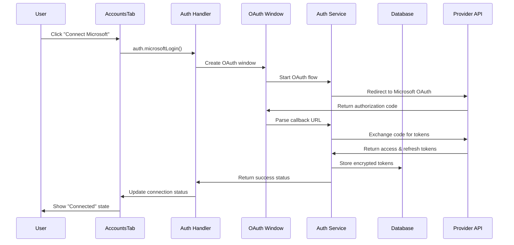

# 🔐 OAuth Authentication Implementation Plan
## Microsoft & Google Integration for Xavi9 Prototype

---

## 📋 Table of Contents

1. [Overview](#-overview)
2. [Architecture Design](#-architecture-design)
3. [OAuth Flow Implementation](#-oauth-flow-implementation)
4. [Database Schema](#-database-schema)
5. [Security Considerations](#-security-considerations)
6. [File Structure](#-file-structure)
7. [Implementation Steps](#-implementation-steps)
8. [API Integration](#-api-integration)
9. [Error Handling](#-error-handling)
10. [Testing Strategy](#-testing-strategy)

---

## 🎯 Overview

This document outlines the implementation plan for OAuth authentication with Microsoft and Google in the Xavi9 Prototype Electron application. The implementation will enable secure authentication using separate Electron windows for OAuth flows and automatic token refresh capabilities.

### 🔧 Key Requirements

- **Microsoft OAuth 2.0**: Access to Microsoft Graph API (Outlook, Calendar, OneDrive)
- **Google OAuth 2.0**: Access to Google APIs (Gmail, Calendar, Drive)
- **Electron-specific**: Separate authentication windows (no browser dependency)
- **Token Management**: Automatic refresh before expiration
- **Security**: Encrypted token storage and secure IPC communication
- **User Experience**: Seamless integration with existing UI

### 🎨 Current State Analysis

The application already has:
- ✅ `AuthToken` model in Prisma schema
- ✅ Basic auth interface in `electron.d.ts`
- ✅ AccountsTab UI component ready
- ✅ Security utilities for encryption
- ✅ IPC handler architecture

---

## 🏗️ Architecture Design

### 📊 Component Overview

```
┌─────────────────────────────────────────────────────────┐
│                    OAUTH ARCHITECTURE                   │
├─────────────────────────────────────────────────────────┤
│                                                         │
│  ┌─ FRONTEND (React) ─────────────────────────────────┐ │
│  │                                                   │ │
│  │  AccountsTab Component                           │ │
│  │  ├── Connect/Disconnect buttons                  │ │
│  │  ├── Connection status display                   │ │
│  │  └── Account information                         │ │
│  │                                                   │ │
│  │  AuthStore (Zustand)                            │ │
│  │  ├── Authentication state                        │ │
│  │  ├── Token management                            │ │
│  │  └── Provider status                             │ │
│  │                                                   │ │
│  └───────────────────────────────────────────────────┘ │
│                         │                               │
│                    ┌─ IPC ─┐                            │
│                    │       │                            │
│  ┌─ ELECTRON MAIN PROCESS ─────────────────────────────┐ │
│  │                 │       │                         │ │
│  │  OAuth Windows Manager                             │ │
│  │  ├── Microsoft OAuth Window                       │ │
│  │  ├── Google OAuth Window                          │ │
│  │  └── Window lifecycle management                  │ │
│  │                                                   │ │
│  │  Auth Handlers (IPC)                             │ │
│  │  ├── auth.handler.ts                             │ │
│  │  ├── Token refresh scheduler                     │ │
│  │  └── Provider-specific flows                     │ │
│  │                                                   │ │
│  │  Auth Services                                   │ │
│  │  ├── MicrosoftAuthService                        │ │
│  │  ├── GoogleAuthService                           │ │
│  │  └── TokenRefreshService                         │ │
│  │                                                   │ │
│  └───────────────────────────────────────────────────┘ │
│                         │                               │
│                         ▼                               │
│  ┌─ SECURE TOKEN STORAGE ─────────────────────────────┐ │
│  │                                                   │ │
│  │  AuthToken Model (Prisma)                        │ │
│  │  ├── Encrypted access tokens                     │ │
│  │  ├── Encrypted refresh tokens                    │ │
│  │  ├── Expiration tracking                         │ │
│  │  └── Provider-specific metadata                  │ │
│  │                                                   │ │
│  └───────────────────────────────────────────────────┘ │
│                                                         │
└─────────────────────────────────────────────────────────┘
```

### 🔄 OAuth Flow Diagram



---

## 🔐 OAuth Flow Implementation

### 🎯 Microsoft OAuth Flow

```typescript
// Microsoft OAuth Configuration
const MICROSOFT_CONFIG = {
  clientId: process.env.MICROSOFT_CLIENT_ID,
  authority: 'https://login.microsoftonline.com/common',
  redirectUri: 'http://localhost:3000/auth/microsoft/callback',
  scopes: [
    'https://graph.microsoft.com/User.Read',
    'https://graph.microsoft.com/Mail.Read',
    'https://graph.microsoft.com/Mail.Send',
    'https://graph.microsoft.com/Calendars.ReadWrite',
    'https://graph.microsoft.com/Files.ReadWrite.All'
  ]
}

// OAuth Flow Steps:
// 1. Create BrowserWindow with OAuth URL
// 2. Listen for redirect to callback URL
// 3. Extract authorization code from callback
// 4. Exchange code for access/refresh tokens
// 5. Store tokens securely in database
// 6. Set up automatic refresh timer
```

### 🎯 Google OAuth Flow

```typescript
// Google OAuth Configuration
const GOOGLE_CONFIG = {
  clientId: process.env.GOOGLE_CLIENT_ID,
  clientSecret: process.env.GOOGLE_CLIENT_SECRET,
  redirectUri: 'http://localhost:3000/auth/google/callback',
  scopes: [
    'https://www.googleapis.com/auth/userinfo.profile',
    'https://www.googleapis.com/auth/userinfo.email',
    'https://www.googleapis.com/auth/gmail.readonly',
    'https://www.googleapis.com/auth/gmail.send',
    'https://www.googleapis.com/auth/calendar',
    'https://www.googleapis.com/auth/drive.file'
  ]
}

// OAuth Flow Steps:
// 1. Create BrowserWindow with Google OAuth URL
// 2. Handle authorization callback
// 3. Exchange authorization code for tokens
// 4. Store tokens with encryption
// 5. Schedule automatic token refresh
```

### 🔄 Token Refresh Strategy

```typescript
// Automatic Token Refresh Logic
class TokenRefreshService {
  private refreshTimers: Map<string, NodeJS.Timeout> = new Map()

  // Schedule refresh 5 minutes before expiration
  scheduleRefresh(provider: string, expiresAt: Date) {
    const refreshTime = expiresAt.getTime() - Date.now() - (5 * 60 * 1000)
    
    if (refreshTime > 0) {
      const timer = setTimeout(() => {
        this.refreshToken(provider)
      }, refreshTime)
      
      this.refreshTimers.set(provider, timer)
    }
  }

  // Refresh token process
  async refreshToken(provider: string) {
    // 1. Retrieve current refresh token
    // 2. Call provider refresh endpoint
    // 3. Update stored tokens
    // 4. Schedule next refresh
    // 5. Notify UI of status change
  }
}
```

---

## 🗄️ Database Schema

### 📊 AuthToken Model Enhancement

The existing `AuthToken` model will be utilized with these token types:

```prisma
model AuthToken {
  id          String   @id @default(cuid())
  provider    String   // 'microsoft' | 'google'
  tokenType   String   // 'access' | 'refresh' | 'id'
  accessToken String   // Encrypted access token
  refreshToken String? // Encrypted refresh token
  expiresAt   DateTime? // Token expiration time
  createdAt   DateTime @default(now())
  updatedAt   DateTime @updatedAt

  @@unique([provider, tokenType])
  @@map("auth_tokens")
}
```

### 📋 Additional User Profile Model

```prisma
model UserProfile {
  id          String   @id @default(cuid())
  provider    String   // 'microsoft' | 'google'
  providerId  String   // User ID from provider
  email       String
  name        String?
  pictureUrl  String?
  isActive    Boolean  @default(true)
  metadata    String?  // Additional profile data as JSON
  createdAt   DateTime @default(now())
  updatedAt   DateTime @updatedAt

  @@unique([provider, providerId])
  @@map("user_profiles")
}
```

---

## 🔒 Security Considerations

### 🛡️ Token Security

1. **Encryption**: All tokens encrypted using Electron's safeStorage API
2. **Storage**: Tokens stored in local SQLite database with encryption
3. **Transmission**: Secure IPC communication between processes
4. **Access Control**: Tokens only accessible through authenticated IPC handlers

### 🔐 Implementation Details

```typescript
// Token Encryption Service
class TokenSecurityService {
  async encryptToken(token: string): Promise<string> {
    // Use Electron's safeStorage for OS-level encryption
    const encrypted = safeStorage.encryptString(token)
    return encrypted.toString('base64')
  }

  async decryptToken(encryptedToken: string): Promise<string> {
    const buffer = Buffer.from(encryptedToken, 'base64')
    return safeStorage.decryptString(buffer)
  }

  // Additional security measures
  async storeTokenSecurely(provider: string, tokenData: TokenData) {
    const encryptedAccess = await this.encryptToken(tokenData.accessToken)
    const encryptedRefresh = tokenData.refreshToken 
      ? await this.encryptToken(tokenData.refreshToken) 
      : null

    // Store in database with encryption
    await this.databaseService.storeAuthToken({
      provider,
      tokenType: 'access',
      accessToken: encryptedAccess,
      refreshToken: encryptedRefresh,
      expiresAt: tokenData.expiresAt
    })
  }
}
```

### 🔍 Security Checklist

- ✅ No tokens stored in plain text
- ✅ Secure IPC communication only
- ✅ OAuth windows isolated from main application
- ✅ Automatic token cleanup on logout
- ✅ Secure redirect URI validation
- ✅ CSRF protection with state parameter
- ✅ Proper error handling without token exposure

---

## 📁 File Structure

```
Xavi9-Prototype/
├── 📁 electron/
│   ├── handlers/
│   │   ├── auth.handler.ts              # 🔐 OAuth IPC handlers
│   │   └── index.ts                     # Updated handler registration
│   ├── services/
│   │   ├── auth/
│   │   │   ├── microsoft.auth.service.ts # 🏢 Microsoft OAuth service
│   │   │   ├── google.auth.service.ts   # 🔍 Google OAuth service
│   │   │   ├── token.refresh.service.ts # 🔄 Token refresh service
│   │   │   └── oauth.window.manager.ts  # 🪟 OAuth window management
│   │   └── security/
│   │       └── token.security.service.ts # 🔒 Token encryption service
│   └── main.ts                          # Updated with auth initialization
│
├── 📁 backend/
│   ├── services/
│   │   ├── auth.service.ts              # 🔐 Authentication business logic
│   │   └── user.profile.service.ts      # 👤 User profile management
│   └── models/
│       └── auth.models.ts               # 📊 Authentication type definitions
│
├── 📁 src/
│   ├── stores/
│   │   └── authStore.ts                 # 🗄️ Authentication state management
│   ├── services/
│   │   └── auth/
│   │       ├── microsoft.client.ts      # 🏢 Microsoft Graph API client
│   │       └── google.client.ts         # 🔍 Google APIs client
│   ├── components/
│   │   └── settings/
│   │       └── tabs/
│   │           └── AccountsTab.tsx      # 📋 Updated accounts interface
│   └── types/
│       ├── auth.types.ts                # 🔐 Authentication types
│       └── electron.d.ts                # Updated with auth methods
│
├── 📁 prisma/
│   └── schema.prisma                    # Updated with UserProfile model
│
└── 📁 docs/
    └── auth/
        └── README.md                    # 📖 This implementation plan
```

---

## 🚀 Implementation Steps

### Phase 1: Core Infrastructure (Week 1) ✅ COMPLETED

1. **Database Setup** ✅
   - [x] Add UserProfile model to Prisma schema
   - [x] Run database migrations
   - [x] Create database service methods

2. **Security Layer** ✅
   - [x] Implement TokenSecurityService
   - [x] Add encryption/decryption utilities
   - [x] Create secure storage methods

3. **Basic IPC Structure** ✅
   - [x] Create auth.handler.ts
   - [x] Update electron.d.ts with auth methods
   - [x] Register auth handlers in main process

### Phase 2: OAuth Windows & Services (Week 2) ✅ COMPLETED

1. **OAuth Window Manager** ✅
   - [x] Create OAuthWindowManager class
   - [x] Implement window lifecycle management
   - [x] Add callback URL handling

2. **Provider Services** ✅
   - [x] Implement MicrosoftAuthService
   - [x] Implement GoogleAuthService
   - [x] Add OAuth flow logic

3. **Token Management** ✅
   - [x] Create TokenRefreshService
   - [x] Implement automatic refresh scheduling
   - [x] Add refresh logic for both providers

### Phase 3: Frontend Integration (Week 3) ✅ COMPLETED

1. **State Management** ✅
   - [x] Create authStore with Zustand
   - [x] Add authentication state management
   - [x] Implement provider status tracking

2. **UI Components** ✅
   - [x] Update AccountsTab component
   - [x] Add connect/disconnect functionality
   - [x] Implement connection status display

3. **API Clients** ✅
   - [x] Create Microsoft Graph client
   - [x] Create Google APIs client
   - [x] Add basic API integration

### Phase 4: Testing & Refinement (Week 4)

1. **Testing**
   - [ ] Unit tests for auth services
   - [ ] Integration tests for OAuth flows
   - [ ] Security testing

2. **Error Handling**
   - [ ] Comprehensive error handling
   - [ ] User-friendly error messages
   - [ ] Logging and monitoring

3. **Documentation**
   - [ ] Update API documentation
   - [ ] Create user guides
   - [ ] Add troubleshooting guides

---

## 🔌 API Integration

### 🏢 Microsoft Graph API

```typescript
// Microsoft Graph API Client
class MicrosoftGraphClient {
  private baseUrl = 'https://graph.microsoft.com/v1.0'
  
  async getProfile(): Promise<UserProfile> {
    const response = await this.authenticatedRequest('/me')
    return response.data
  }

  async getEmails(top: number = 10): Promise<EmailMessage[]> {
    const response = await this.authenticatedRequest(`/me/messages?$top=${top}`)
    return response.data.value
  }

  async getCalendarEvents(): Promise<CalendarEvent[]> {
    const response = await this.authenticatedRequest('/me/events')
    return response.data.value
  }

  private async authenticatedRequest(endpoint: string, options?: RequestOptions) {
    const token = await this.getValidToken()
    return fetch(`${this.baseUrl}${endpoint}`, {
      headers: {
        'Authorization': `Bearer ${token}`,
        'Content-Type': 'application/json'
      },
      ...options
    })
  }
}
```

### 🔍 Google APIs Client

```typescript
// Google APIs Client
class GoogleApisClient {
  private baseUrl = 'https://www.googleapis.com'
  
  async getProfile(): Promise<UserProfile> {
    const response = await this.authenticatedRequest('/oauth2/v1/userinfo')
    return response.data
  }

  async getGmailMessages(maxResults: number = 10): Promise<EmailMessage[]> {
    const response = await this.authenticatedRequest(
      `/gmail/v1/users/me/messages?maxResults=${maxResults}`
    )
    return response.data.messages
  }

  async getCalendarEvents(calendarId: string = 'primary'): Promise<CalendarEvent[]> {
    const response = await this.authenticatedRequest(
      `/calendar/v3/calendars/${calendarId}/events`
    )
    return response.data.items
  }

  private async authenticatedRequest(endpoint: string, options?: RequestOptions) {
    const token = await this.getValidToken()
    return fetch(`${this.baseUrl}${endpoint}`, {
      headers: {
        'Authorization': `Bearer ${token}`,
        'Content-Type': 'application/json'
      },
      ...options
    })
  }
}
```

---

## ⚠️ Error Handling

### 🔍 Error Categories

1. **Authentication Errors**
   - Invalid credentials
   - Expired tokens
   - OAuth flow interruption
   - Network connectivity issues

2. **API Errors**
   - Rate limiting
   - Permission denied
   - Service unavailable
   - Invalid requests

3. **Application Errors**
   - Database connection issues
   - Encryption/decryption failures
   - IPC communication errors

### 🛠️ Error Handling Strategy

```typescript
// Centralized Error Handling
class AuthErrorHandler {
  static handleAuthError(error: AuthError, provider: string) {
    switch (error.type) {
      case 'TOKEN_EXPIRED':
        return this.handleTokenExpired(provider)
      case 'INVALID_CREDENTIALS':
        return this.handleInvalidCredentials(provider)
      case 'NETWORK_ERROR':
        return this.handleNetworkError()
      case 'PERMISSION_DENIED':
        return this.handlePermissionDenied(provider)
      default:
        return this.handleGenericError(error)
    }
  }

  private static async handleTokenExpired(provider: string) {
    // Attempt automatic token refresh
    try {
      await tokenRefreshService.refreshToken(provider)
      return { success: true, message: 'Token refreshed automatically' }
    } catch (refreshError) {
      // Require re-authentication
      return { 
        success: false, 
        message: 'Please reconnect your account',
        requiresReauth: true 
      }
    }
  }
}
```

---

## 🧪 Testing Strategy

### 🔬 Unit Testing

```typescript
// Example Test Suite
describe('MicrosoftAuthService', () => {
  let authService: MicrosoftAuthService
  let mockDatabase: MockDatabaseService

  beforeEach(() => {
    mockDatabase = new MockDatabaseService()
    authService = new MicrosoftAuthService(mockDatabase)
  })

  describe('authenticate', () => {
    it('should successfully authenticate with valid credentials', async () => {
      // Test OAuth flow
      const result = await authService.authenticate('valid_auth_code')
      expect(result.success).toBe(true)
      expect(result.tokens).toBeDefined()
    })

    it('should handle invalid authorization code', async () => {
      // Test error handling
      const result = await authService.authenticate('invalid_code')
      expect(result.success).toBe(false)
      expect(result.error).toBe('INVALID_AUTHORIZATION_CODE')
    })
  })

  describe('refreshToken', () => {
    it('should refresh expired tokens', async () => {
      // Mock expired token
      mockDatabase.setAuthToken('microsoft', 'refresh', 'valid_refresh_token')
      
      const result = await authService.refreshToken()
      expect(result.success).toBe(true)
      expect(result.newAccessToken).toBeDefined()
    })
  })
})
```

### 🔄 Integration Testing

```typescript
// Integration Test Example
describe('OAuth Flow Integration', () => {
  it('should complete full Microsoft OAuth flow', async () => {
    // 1. Start OAuth flow
    const authWindow = await oauthWindowManager.createMicrosoftWindow()
    
    // 2. Simulate user authentication
    await simulateUserLogin(authWindow, 'test@example.com', 'password')
    
    // 3. Verify callback handling
    const tokens = await waitForTokens('microsoft')
    expect(tokens).toBeDefined()
    
    // 4. Verify token storage
    const storedTokens = await databaseService.getAuthTokens('microsoft')
    expect(storedTokens.length).toBeGreaterThan(0)
    
    // 5. Verify API access
    const profile = await microsoftGraphClient.getProfile()
    expect(profile.email).toBe('test@example.com')
  })
})
```

---

## 📝 Environment Configuration

### 🔧 Required Environment Variables

```bash
# .env file
# Microsoft OAuth
MICROSOFT_CLIENT_ID=your_microsoft_client_id
MICROSOFT_CLIENT_SECRET=your_microsoft_client_secret

# Google OAuth
GOOGLE_CLIENT_ID=your_google_client_id
GOOGLE_CLIENT_SECRET=your_google_client_secret

# Development
OAUTH_CALLBACK_PORT=3000
OAUTH_CALLBACK_HOST=localhost

# Production
OAUTH_CALLBACK_URL_MICROSOFT=https://your-app.com/auth/microsoft/callback
OAUTH_CALLBACK_URL_GOOGLE=https://your-app.com/auth/google/callback
```

### 🏗️ OAuth Application Setup

#### Microsoft Azure AD
1. Register application in Azure AD
2. Configure redirect URIs
3. Add required permissions (Microsoft Graph)
4. Generate client secret

#### Google Cloud Console
1. Create OAuth 2.0 credentials
2. Configure authorized redirect URIs
3. Enable required APIs (Gmail, Calendar, Drive)
4. Set up consent screen

---

## 🎯 Success Metrics

### 📊 Implementation Success Criteria

1. **Functional Requirements**
   - [ ] Users can authenticate with Microsoft and Google
   - [ ] Tokens are automatically refreshed
   - [ ] Connection status is accurately displayed
   - [ ] Users can disconnect accounts

2. **Security Requirements**
   - [ ] All tokens are encrypted at rest
   - [ ] No sensitive data exposed in logs
   - [ ] Secure IPC communication
   - [ ] Proper error handling without information leakage

3. **Performance Requirements**
   - [ ] OAuth flow completes in < 30 seconds
   - [ ] Token refresh happens automatically
   - [ ] UI remains responsive during authentication
   - [ ] No memory leaks in OAuth windows

4. **User Experience Requirements**
   - [ ] Clear connection status indicators
   - [ ] Intuitive connect/disconnect flow
   - [ ] Helpful error messages
   - [ ] Seamless integration with existing UI

---

## 📚 Additional Resources

### 📖 Documentation Links

- [Microsoft Graph API Documentation](https://docs.microsoft.com/en-us/graph/)
- [Google APIs Documentation](https://developers.google.com/apis-explorer)
- [Electron Security Best Practices](https://www.electronjs.org/docs/tutorial/security)
- [OAuth 2.0 Security Best Practices](https://tools.ietf.org/html/draft-ietf-oauth-security-topics)

### 🔧 Development Tools

- **Testing**: Jest, @testing-library/react
- **OAuth Testing**: Postman, OAuth 2.0 Playground
- **Security Testing**: OWASP ZAP, Burp Suite
- **Database**: Prisma Studio, SQLite Browser

---

## 🏁 Conclusion

This implementation plan provides a comprehensive approach to adding Microsoft and Google OAuth authentication to the Xavi9 Prototype application. The architecture prioritizes security, user experience, and maintainability while leveraging the existing infrastructure.

The phased implementation approach ensures steady progress and allows for testing and refinement at each stage. The modular design makes it easy to extend support for additional providers in the future.

Key benefits of this implementation:
- 🔒 **Secure**: Encrypted token storage and secure IPC communication
- 🔄 **Automatic**: Token refresh without user intervention
- 🎨 **Seamless**: Integrated with existing UI and architecture
- 🧪 **Testable**: Comprehensive testing strategy
- 📈 **Scalable**: Easy to extend for additional providers

---

**📝 Document Version**: 1.0  
**🗓️ Created**: July 1, 2025  
**👨‍💻 Architecture**: OAuth 2.0 with Electron Integration  
**🔄 Status**: Ready for Implementation