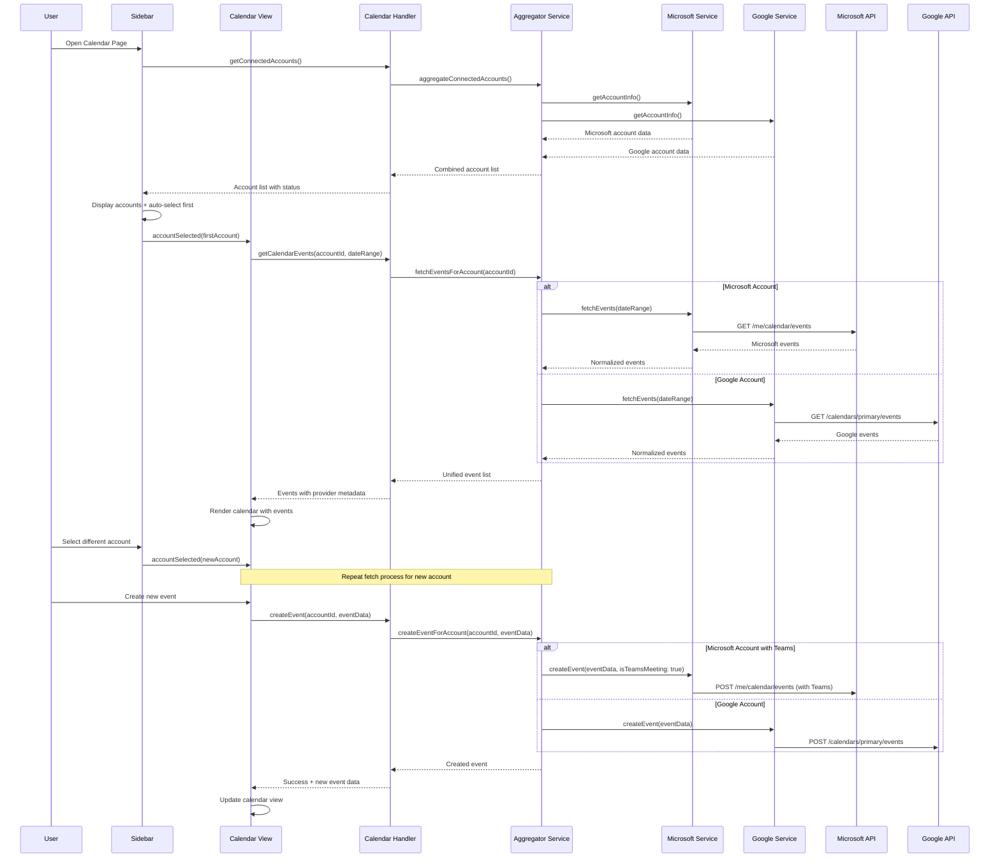

# 📅 Calendar Integration Implementation Plan
## Multi-Provider Calendar Management for Xavi9 Prototype

---

## 📋 Table of Contents

1. [Overview](#-overview)
2. [Architecture Design](#-architecture-design)
3. [Calendar Data Flow](#-calendar-data-flow)
4. [API Integration](#-api-integration)
5. [Component Structure](#-component-structure)
6. [IPC Handlers](#-ipc-handlers)
7. [Calendar Services](#-calendar-services)
8. [UI/UX Design](#-uiux-design)
9. [Teams Integration](#-teams-integration)
10. [Implementation Steps](#-implementation-steps)
11. [File Structure](#-file-structure)
12. [Error Handling](#-error-handling)
13. [Performance Considerations](#-performance-considerations)

---

## 🎯 Overview

This document outlines the implementation of a comprehensive calendar system that integrates Microsoft and Google calendars into a unified interface. The system provides real-time synchronization with cloud providers without local data persistence.

### 🔧 Key Requirements

- **Multi-Provider Support**: Microsoft Graph Calendar + Google Calendar APIs
- **Unified Interface**: Single calendar view with events from all connected accounts
- **Real-time Sync**: Direct API integration without local persistence
- **Account Switching**: Sidebar with account selection and automatic loading
- **CRUD Operations**: Create, Read, Update, Delete events across providers
- **Teams Integration**: Microsoft Teams meeting support
- **Responsive Loading**: Progressive loading with proper loading states

### 🎨 Core Features

- ✅ **Account Sidebar**: Visual account selector with connection status
- ✅ **Unified Calendar View**: Combined events from all providers
- ✅ **Event Management**: Full CRUD operations with provider-specific features
- ✅ **Teams Meetings**: Automatic Teams meeting creation for Microsoft events
- ✅ **Real-time Updates**: Live synchronization with cloud providers
- ✅ **Smart Loading**: Intelligent caching and progressive loading

---

## 🏗️ Architecture Design

### 📊 System Architecture

```
┌─────────────────────────────────────────────────────────┐
│                    CALENDAR ARCHITECTURE                │
├─────────────────────────────────────────────────────────┤
│                                                         │
│  ┌─ FRONTEND (React) ─────────────────────────────────┐ │
│  │                                                   │ │
│  │  Calendar Page Component                          │ │
│  │  ├── Sidebar Component (Account Selector)        │ │
│  │  │   ├── Account cards with status               │ │
│  │  │   ├── Provider icons and info                 │ │
│  │  │   └── Active account highlighting             │ │
│  │  │                                               │ │
│  │  ├── Calendar View Component                     │ │
│  │  │   ├── Month/Week/Day views                    │ │
│  │  │   ├── Event rendering with provider colors    │ │
│  │  │   ├── Event creation modal                    │ │
│  │  │   └── Event editing interface                 │ │
│  │  │                                               │ │
│  │  └── Calendar Store (Zustand)                    │ │
│  │      ├── Multi-provider event aggregation       │ │
│  │      ├── Active account management               │ │
│  │      ├── Loading states per provider             │ │
│  │      └── Event CRUD operations                   │ │
│  │                                                   │ │
│  └───────────────────────────────────────────────────┘ │
│                         │                               │
│                    ┌─ IPC ─┐                            │
│                    │       │                            │
│  ┌─ ELECTRON MAIN PROCESS ─────────────────────────────┐ │
│  │                 │       │                         │ │
│  │  Calendar IPC Handlers                             │ │
│  │  ├── calendar.handler.ts                          │ │
│  │  │   ├── Get connected accounts                   │ │
│  │  │   ├── Fetch events by provider                 │ │
│  │  │   ├── Create/Update/Delete events              │ │
│  │  │   └── Teams meeting integration                │ │
│  │  │                                               │ │
│  │  Calendar Services Layer                          │ │
│  │  ├── CalendarAggregatorService                   │ │
│  │  │   ├── Multi-provider event fetching           │ │
│  │  │   ├── Event normalization                     │ │
│  │  │   └── Concurrent provider operations          │ │
│  │  │                                               │ │
│  │  ├── MicrosoftCalendarService                    │ │
│  │  │   ├── Graph Calendar API integration          │ │
│  │  │   ├── Teams meeting creation                  │ │
│  │  │   └── Microsoft-specific features             │ │
│  │  │                                               │ │
│  │  ├── GoogleCalendarService                       │ │
│  │  │   ├── Google Calendar API integration         │ │
│  │  │   ├── Google Meet integration                 │ │
│  │  │   └── Google-specific features                │ │
│  │  │                                               │ │
│  │  └── CalendarCacheService                        │ │
│  │      ├── In-memory event caching                 │ │
│  │      ├── Smart refresh strategies                │ │
│  │      └── Performance optimization                │ │
│  │                                                   │ │
│  └───────────────────────────────────────────────────┘ │
│                         │                               │
│                         ▼                               │
│  ┌─ CLOUD PROVIDER APIS ──────────────────────────────┐ │
│  │                                                   │ │
│  │  Microsoft Graph Calendar API                    │ │
│  │  ├── /me/calendars                               │ │
│  │  ├── /me/events                                  │ │
│  │  ├── /me/calendar/events (CRUD)                  │ │
│  │  └── Teams meeting integration                   │ │
│  │                                                   │ │
│  │  Google Calendar API                             │ │
│  │  ├── /calendars                                  │ │
│  │  ├── /calendars/{id}/events                      │ │
│  │  ├── Event CRUD operations                       │ │
│  │  └── Google Meet integration                     │ │
│  │                                                   │ │
│  └───────────────────────────────────────────────────┘ │
│                                                         │
└─────────────────────────────────────────────────────────┘
```

### 🔄 Calendar Data Flow



---

## 🔌 API Integration

### 🏢 Microsoft Graph Calendar API

```typescript
// Microsoft Calendar Integration
interface MicrosoftCalendarEvent {
  id: string
  subject: string
  body: {
    contentType: 'html' | 'text'
    content: string
  }
  start: {
    dateTime: string
    timeZone: string
  }
  end: {
    dateTime: string
    timeZone: string
  }
  location?: {
    displayName: string
    address?: any
  }
  attendees?: Array<{
    emailAddress: {
      address: string
      name: string
    }
    status: {
      response: 'none' | 'accepted' | 'declined' | 'tentative'
      time: string
    }
  }>
  isOnlineMeeting?: boolean
  onlineMeetingProvider?: 'teamsForBusiness'
  onlineMeeting?: {
    joinUrl: string
    conferenceId: string
  }
  recurrence?: any
  reminderMinutesBeforeStart?: number
  showAs: 'free' | 'tentative' | 'busy' | 'oof' | 'workingElsewhere' | 'unknown'
  sensitivity: 'normal' | 'personal' | 'private' | 'confidential'
}

// Microsoft Calendar Service Methods
class MicrosoftCalendarService {
  // Core CRUD operations
  async getEvents(startDate: Date, endDate: Date): Promise<MicrosoftCalendarEvent[]>
  async getEvent(eventId: string): Promise<MicrosoftCalendarEvent>
  async createEvent(event: Partial<MicrosoftCalendarEvent>): Promise<MicrosoftCalendarEvent>
  async updateEvent(eventId: string, event: Partial<MicrosoftCalendarEvent>): Promise<MicrosoftCalendarEvent>
  async deleteEvent(eventId: string): Promise<void>
  
  // Teams meeting specific
  async createTeamsMeeting(event: Partial<MicrosoftCalendarEvent>): Promise<MicrosoftCalendarEvent>
  async addTeamsMeetingToEvent(eventId: string): Promise<MicrosoftCalendarEvent>
  
  // Calendar management
  async getCalendars(): Promise<any[]>
  async getCalendar(calendarId: string): Promise<any>
}
```

### 🔍 Google Calendar API

```typescript
// Google Calendar Integration
interface GoogleCalendarEvent {
  id: string
  summary: string
  description?: string
  start: {
    dateTime?: string
    date?: string
    timeZone?: string
  }
  end: {
    dateTime?: string
    date?: string
    timeZone?: string
  }
  location?: string
  attendees?: Array<{
    email: string
    displayName?: string
    responseStatus: 'needsAction' | 'declined' | 'tentative' | 'accepted'
  }>
  conferenceData?: {
    createRequest?: {
      requestId: string
      conferenceSolutionKey: {
        type: 'hangoutsMeet'
      }
    }
    entryPoints?: Array<{
      entryPointType: 'video' | 'phone'
      uri: string
      label?: string
    }>
  }
  recurrence?: string[]
  reminders?: {
    useDefault: boolean
    overrides?: Array<{
      method: 'email' | 'popup'
      minutes: number
    }>
  }
  visibility: 'default' | 'public' | 'private' | 'confidential'
  status: 'confirmed' | 'tentative' | 'cancelled'
}

// Google Calendar Service Methods
class GoogleCalendarService {
  // Core CRUD operations
  async getEvents(startDate: Date, endDate: Date): Promise<GoogleCalendarEvent[]>
  async getEvent(eventId: string): Promise<GoogleCalendarEvent>
  async createEvent(event: Partial<GoogleCalendarEvent>): Promise<GoogleCalendarEvent>
  async updateEvent(eventId: string, event: Partial<GoogleCalendarEvent>): Promise<GoogleCalendarEvent>
  async deleteEvent(eventId: string): Promise<void>
  
  // Google Meet specific
  async createMeetEvent(event: Partial<GoogleCalendarEvent>): Promise<GoogleCalendarEvent>
  async addMeetToEvent(eventId: string): Promise<GoogleCalendarEvent>
  
  // Calendar management
  async getCalendars(): Promise<any[]>
  async getCalendar(calendarId: string): Promise<any>
}
```

---

## 🧩 Component Structure

### 📱 Calendar Page Component

```typescript
// Main Calendar Page Component
interface CalendarPageProps {}

interface CalendarPageState {
  selectedAccount: string | null
  currentView: 'month' | 'week' | 'day'
  currentDate: Date
  isLoading: boolean
  error: string | null
}

const CalendarPage: React.FC<CalendarPageProps> = () => {
  // State management with Zustand store
  const {
    connectedAccounts,
    selectedAccount,
    events,
    isLoading,
    error,
    // Actions
    loadConnectedAccounts,
    selectAccount,
    loadEvents,
    createEvent,
    updateEvent,
    deleteEvent
  } = useCalendarStore()

  // Auto-load first account on mount
  useEffect(() => {
    initializeCalendar()
  }, [])

  const initializeCalendar = async () => {
    await loadConnectedAccounts()
    // Auto-select first available account
    if (connectedAccounts.length > 0) {
      selectAccount(connectedAccounts[0].id)
    }
  }

  return (
    <div className="calendar-page">
      <Sidebar 
        accounts={connectedAccounts}
        selectedAccount={selectedAccount}
        onAccountSelect={selectAccount}
        isLoading={isLoading}
      />
      <CalendarView 
        events={events}
        selectedAccount={selectedAccount}
        currentView={currentView}
        currentDate={currentDate}
        isLoading={isLoading}
        error={error}
        onEventCreate={createEvent}
        onEventUpdate={updateEvent}
        onEventDelete={deleteEvent}
      />
    </div>
  )
}
```

### 🔧 Sidebar Component

```typescript
// Generic Sidebar Component for Account Selection
interface SidebarAccount {
  id: string
  provider: 'microsoft' | 'google'
  email: string
  name: string
  pictureUrl?: string
  isConnected: boolean
  hasCalendarAccess: boolean
  lastSync?: Date
  calendarCount?: number
}

interface SidebarProps {
  accounts: SidebarAccount[]
  selectedAccount: string | null
  onAccountSelect: (accountId: string) => void
  isLoading: boolean
  className?: string
}

const Sidebar: React.FC<SidebarProps> = ({
  accounts,
  selectedAccount,
  onAccountSelect,
  isLoading,
  className
}) => {
  return (
    <div className={`sidebar ${className}`}>
      <div className="sidebar-header">
        <h3>Connected Accounts</h3>
        {isLoading && <LoadingSpinner size="small" />}
      </div>
      
      <div className="sidebar-content">
        {accounts.length === 0 ? (
          <EmptyAccountsState />
        ) : (
          accounts.map(account => (
            <AccountCard
              key={account.id}
              account={account}
              isSelected={selectedAccount === account.id}
              onSelect={() => onAccountSelect(account.id)}
              isLoading={isLoading}
            />
          ))
        )}
      </div>
      
      <div className="sidebar-footer">
        <Button variant="ghost" size="sm">
          <Plus className="w-4 h-4 mr-2" />
          Add Account
        </Button>
      </div>
    </div>
  )
}

// Account Card Component
interface AccountCardProps {
  account: SidebarAccount
  isSelected: boolean
  onSelect: () => void
  isLoading: boolean
}

const AccountCard: React.FC<AccountCardProps> = ({
  account,
  isSelected,
  onSelect,
  isLoading
}) => {
  const getProviderIcon = (provider: string) => {
    switch (provider) {
      case 'microsoft': return <MicrosoftIcon />
      case 'google': return <GoogleIcon />
      default: return <AccountIcon />
    }
  }

  const getStatusColor = (account: SidebarAccount) => {
    if (!account.isConnected) return 'text-red-500'
    if (!account.hasCalendarAccess) return 'text-yellow-500'
    return 'text-green-500'
  }

  return (
    <div 
      className={`account-card ${isSelected ? 'selected' : ''} ${isLoading ? 'loading' : ''}`}
      onClick={onSelect}
    >
      <div className="account-card-header">
        <div className="account-avatar">
          {account.pictureUrl ? (
            
          ) : (
            <div className="avatar-placeholder">{account.name[0]}</div>
          )}
          <div className="provider-badge">
            {getProviderIcon(account.provider)}
          </div>
        </div>
        
        <div className="account-info">
          <h4 className="account-name">{account.name}</h4>
          <p className="account-email">{account.email}</p>
        </div>
        
        <div className={`connection-status ${getStatusColor(account)}`}>
          <ConnectionStatusIcon account={account} />
        </div>
      </div>
      
      <div className="account-card-footer">
        <div className="account-stats">
          {account.calendarCount && (
            <span className="stat">
              <Calendar className="w-3 h-3" />
              {account.calendarCount} calendars
            </span>
          )}
          {account.lastSync && (
            <span className="stat">
              <Clock className="w-3 h-3" />
              {formatLastSync(account.lastSync)}
            </span>
          )}
        </div>
        
        {isSelected && isLoading && (
          <div className="loading-indicator">
            <LoadingSpinner size="xs" />
            <span>Loading events...</span>
          </div>
        )}
      </div>
    </div>
  )
}
```

### 📅 Calendar View Component

```typescript
// Calendar View Component
interface CalendarViewProps {
  events: UnifiedCalendarEvent[]
  selectedAccount: string | null
  currentView: 'month' | 'week' | 'day'
  currentDate: Date
  isLoading: boolean
  error: string | null
  onEventCreate: (event: CreateEventData) => Promise<void>
  onEventUpdate: (eventId: string, event: UpdateEventData) => Promise<void>
  onEventDelete: (eventId: string) => Promise<void>
}

const CalendarView: React.FC<CalendarViewProps> = ({
  events,
  selectedAccount,
  currentView,
  currentDate,
  isLoading,
  error,
  onEventCreate,
  onEventUpdate,
  onEventDelete
}) => {
  const [showEventModal, setShowEventModal] = useState(false)
  const [selectedEvent, setSelectedEvent] = useState<UnifiedCalendarEvent | null>(null)
  const [eventModalMode, setEventModalMode] = useState<'create' | 'edit' | 'view'>('view')

  const handleEventClick = (event: UnifiedCalendarEvent) => {
    setSelectedEvent(event)
    setEventModalMode('view')
    setShowEventModal(true)
  }

  const handleCreateEvent = (dateTime?: Date) => {
    setSelectedEvent(null)
    setEventModalMode('create')
    setShowEventModal(true)
  }

  const handleEditEvent = (event: UnifiedCalendarEvent) => {
    setSelectedEvent(event)
    setEventModalMode('edit')
    setShowEventModal(true)
  }

  if (!selectedAccount) {
    return <NoAccountSelectedState />
  }

  if (error) {
    return <ErrorState error={error} />
  }

  return (
    <div className="calendar-view">
      <CalendarHeader 
        currentView={currentView}
        currentDate={currentDate}
        onViewChange={setCurrentView}
        onDateChange={setCurrentDate}
        onCreateEvent={handleCreateEvent}
        selectedAccount={selectedAccount}
      />
      
      <div className="calendar-content">
        {isLoading ? (
          <CalendarLoadingState />
        ) : (
          <>
            {currentView === 'month' && (
              <MonthView 
                events={events}
                currentDate={currentDate}
                onEventClick={handleEventClick}
                onCreateEvent={handleCreateEvent}
              />
            )}
            {currentView === 'week' && (
              <WeekView 
                events={events}
                currentDate={currentDate}
                onEventClick={handleEventClick}
                onCreateEvent={handleCreateEvent}
              />
            )}
            {currentView === 'day' && (
              <DayView 
                events={events}
                currentDate={currentDate}
                onEventClick={handleEventClick}
                onCreateEvent={handleCreateEvent}
              />
            )}
          </>
        )}
      </div>

      {showEventModal && (
        <EventModal
          mode={eventModalMode}
          event={selectedEvent}
          selectedAccount={selectedAccount}
          onSave={async (eventData) => {
            if (eventModalMode === 'create') {
              await onEventCreate(eventData)
            } else if (eventModalMode === 'edit' && selectedEvent) {
              await onEventUpdate(selectedEvent.id, eventData)
            }
            setShowEventModal(false)
          }}
          onDelete={async () => {
            if (selectedEvent) {
              await onEventDelete(selectedEvent.id)
              setShowEventModal(false)
            }
          }}
          onClose={() => setShowEventModal(false)}
        />
      )}
    </div>
  )
}
```

---

## 🔧 IPC Handlers

### 📡 Calendar IPC Handler

```typescript
// Calendar IPC Handler - electron/handlers/calendar.handler.ts
export class CalendarHandler {
  private calendarAggregator: CalendarAggregatorService
  private microsoftCalendar: MicrosoftCalendarService
  private googleCalendar: GoogleCalendarService
  private logger = databaseLogger

  constructor(databaseService: DatabaseService) {
    this.microsoftCalendar = new MicrosoftCalendarService(databaseService)
    this.googleCalendar = new GoogleCalendarService(databaseService)
    this.calendarAggregator = new CalendarAggregatorService(
      this.microsoftCalendar,
      this.googleCalendar,
      databaseService
    )
    
    this.registerHandlers()
  }

  private registerHandlers(): void {
    // Account management
    ipcMain.handle('calendar-get-connected-accounts', this.handleGetConnectedAccounts.bind(this))
    ipcMain.handle('calendar-get-account-info', this.handleGetAccountInfo.bind(this))
    
    // Event operations
    ipcMain.handle('calendar-get-events', this.handleGetEvents.bind(this))
    ipcMain.handle('calendar-get-event', this.handleGetEvent.bind(this))
    ipcMain.handle('calendar-create-event', this.handleCreateEvent.bind(this))
    ipcMain.handle('calendar-update-event', this.handleUpdateEvent.bind(this))
    ipcMain.handle('calendar-delete-event', this.handleDeleteEvent.bind(this))
    
    // Teams meeting specific
    ipcMain.handle('calendar-create-teams-meeting', this.handleCreateTeamsMeeting.bind(this))
    ipcMain.handle('calendar-add-teams-to-event', this.handleAddTeamsToEvent.bind(this))
    
    // Calendar management
    ipcMain.handle('calendar-get-calendars', this.handleGetCalendars.bind(this))
    ipcMain.handle('calendar-sync-account', this.handleSyncAccount.bind(this))
  }

  /**
   * Get all connected accounts with calendar access
   */
  private async handleGetConnectedAccounts(event: IpcMainInvokeEvent): Promise<any> {
    try {
      this.logger.info('Getting connected accounts for calendar')
      
      const accounts = await this.calendarAggregator.getConnectedAccounts()
      
      return {
        success: true,
        data: accounts
      }
    } catch (error) {
      this.logger.error('Failed to get connected accounts', error as Error)
      return {
        success: false,
        error: `Failed to get accounts: ${error instanceof Error ? error.message : String(error)}`
      }
    }
  }

  /**
   * Get detailed information for a specific account
   */
  private async handleGetAccountInfo(event: IpcMainInvokeEvent, accountId: string): Promise<any> {
    try {
      this.logger.info('Getting account info', { accountId })
      
      const accountInfo = await this.calendarAggregator.getAccountInfo(accountId)
      
      return {
        success: true,
        data: accountInfo
      }
    } catch (error) {
      this.logger.error('Failed to get account info', error as Error, { accountId })
      return {
        success: false,
        error: `Failed to get account info: ${error instanceof Error ? error.message : String(error)}`
      }
    }
  }

  /**
   * Get calendar events for a specific account and date range
   */
  private async handleGetEvents(
    event: IpcMainInvokeEvent, 
    accountId: string, 
    startDate: string, 
    endDate: string
  ): Promise<any> {
    try {
      this.logger.info('Getting calendar events', { accountId, startDate, endDate })
      
      const events = await this.calendarAggregator.getEvents(
        accountId,
        new Date(startDate),
        new Date(endDate)
      )
      
      return {
        success: true,
        data: events
      }
    } catch (error) {
      this.logger.error('Failed to get calendar events', error as Error, { accountId })
      return {
        success: false,
        error: `Failed to get events: ${error instanceof Error ? error.message : String(error)}`
      }
    }
  }

  /**
   * Create a new calendar event
   */
  private async handleCreateEvent(
    event: IpcMainInvokeEvent,
    accountId: string,
    eventData: any
  ): Promise<any> {
    try {
      this.logger.info('Creating calendar event', { accountId, event: eventData.subject || eventData.summary })
      
      const createdEvent = await this.calendarAggregator.createEvent(accountId, eventData)
      
      return {
        success: true,
        data: createdEvent
      }
    } catch (error) {
      this.logger.error('Failed to create calendar event', error as Error, { accountId })
      return {
        success: false,
        error: `Failed to create event: ${error instanceof Error ? error.message : String(error)}`
      }
    }
  }

  /**
   * Create a Teams meeting event (Microsoft only)
   */
  private async handleCreateTeamsMeeting(
    event: IpcMainInvokeEvent,
    accountId: string,
    eventData: any
  ): Promise<any> {
    try {
      this.logger.info('Creating Teams meeting', { accountId, event: eventData.subject })
      
      const meeting = await this.calendarAggregator.createTeamsMeeting(accountId, eventData)
      
      return {
        success: true,
        data: meeting
      }
    } catch (error) {
      this.logger.error('Failed to create Teams meeting', error as Error, { accountId })
      return {
        success: false,
        error: `Failed to create Teams meeting: ${error instanceof Error ? error.message : String(error)}`
      }
    }
  }

  // Additional handlers for update, delete, etc...
}
```

### 📞 IPC Type Definitions

```typescript
// IPC Calendar Types - src/types/calendar.types.ts
export interface CalendarAccount {
  id: string
  provider: 'microsoft' | 'google'
  email: string
  name: string
  pictureUrl?: string
  isConnected: boolean
  hasCalendarAccess: boolean
  lastSync?: Date
  calendarCount?: number
  defaultCalendarId?: string
}

export interface UnifiedCalendarEvent {
  id: string
  provider: 'microsoft' | 'google'
  accountId: string
  title: string
  description?: string
  startTime: Date
  endTime: Date
  isAllDay: boolean
  location?: string
  attendees?: EventAttendee[]
  reminderMinutes?: number
  recurrence?: RecurrencePattern
  
  // Meeting integration
  hasOnlineMeeting: boolean
  meetingUrl?: string
  meetingProvider?: 'teams' | 'meet' | 'other'
  
  // Provider-specific data
  originalEvent: any // Raw event from provider
  providerSpecific?: {
    microsoft?: {
      showAs: string
      sensitivity: string
      isTeamsMeeting: boolean
    }
    google?: {
      visibility: string
      status: string
      conferenceData?: any
    }
  }
}

export interface CreateEventData {
  title: string
  description?: string
  startTime: Date
  endTime: Date
  isAllDay: boolean
  location?: string
  attendees?: string[]
  reminderMinutes?: number
  isTeamsMeeting?: boolean // For Microsoft events
  isGoogleMeet?: boolean // For Google events
}

export interface UpdateEventData extends Partial<CreateEventData> {
  // All fields optional for updates
}

// Electron API Extensions
declare global {
  interface Window {
    electronAPI: {
      calendar: {
        getConnectedAccounts: () => Promise<IpcResult<CalendarAccount[]>>
        getAccountInfo: (accountId: string) => Promise<IpcResult<CalendarAccount>>
        getEvents: (accountId: string, startDate: string, endDate: string) => Promise<IpcResult<UnifiedCalendarEvent[]>>
        getEvent: (accountId: string, eventId: string) => Promise<IpcResult<UnifiedCalendarEvent>>
        createEvent: (accountId: string, eventData: CreateEventData) => Promise<IpcResult<UnifiedCalendarEvent>>
        updateEvent: (accountId: string, eventId: string, eventData: UpdateEventData) => Promise<IpcResult<UnifiedCalendarEvent>>
        deleteEvent: (accountId: string, eventId: string) => Promise<IpcResult<void>>
        createTeamsMeeting: (accountId: string, eventData: CreateEventData) => Promise<IpcResult<UnifiedCalendarEvent>>
        addTeamsToEvent: (accountId: string, eventId: string) => Promise<IpcResult<UnifiedCalendarEvent>>
        syncAccount: (accountId: string) => Promise<IpcResult<void>>
      }
    }
  }
}
```

---

## 🏗️ Calendar Services

### 🎯 Calendar Aggregator Service

```typescript
// Calendar Aggregator Service - electron/services/calendar/calendar.aggregator.service.ts
export class CalendarAggregatorService {
  private microsoftService: MicrosoftCalendarService
  private googleService: GoogleCalendarService
  private databaseService: DatabaseService
  private cacheService: CalendarCacheService
  private logger = databaseLogger

  constructor(
    microsoftService: MicrosoftCalendarService,
    googleService: GoogleCalendarService,
    databaseService: DatabaseService
  ) {
    this.microsoftService = microsoftService
    this.googleService = googleService
    this.databaseService = databaseService
    this.cacheService = new CalendarCacheService()
  }

  /**
   * Get all connected accounts with calendar access
   */
  async getConnectedAccounts(): Promise<CalendarAccount[]> {
    try {
      const accounts: CalendarAccount[] = []
      
      // Get Microsoft accounts
      const microsoftAccounts = await this.getMicrosoftAccounts()
      accounts.push(...microsoftAccounts)
      
      // Get Google accounts
      const googleAccounts = await this.getGoogleAccounts()
      accounts.push(...googleAccounts)
      
      // Sort by provider and connection status
      return accounts.sort((a, b) => {
        if (a.isConnected !== b.isConnected) {
          return a.isConnected ? -1 : 1
        }
        return a.provider.localeCompare(b.provider)
      })
      
    } catch (error) {
      this.logger.error('Failed to get connected accounts', error as Error)
      throw error
    }
  }

  /**
   * Get events for a specific account and date range
   */
  async getEvents(
    accountId: string, 
    startDate: Date, 
    endDate: Date
  ): Promise<UnifiedCalendarEvent[]> {
    try {
      // Check cache first
      const cacheKey = `events_${accountId}_${startDate.toISOString()}_${endDate.toISOString()}`
      const cachedEvents = this.cacheService.get(cacheKey)
      
      if (cachedEvents && !this.cacheService.isExpired(cacheKey)) {
        this.logger.debug('Returning cached events', { accountId, count: cachedEvents.length })
        return cachedEvents
      }

      // Determine provider and fetch events
      const account = await this.getAccountInfo(accountId)
      let events: UnifiedCalendarEvent[]

      if (account.provider === 'microsoft') {
        const rawEvents = await this.microsoftService.getEvents(startDate, endDate)
        events = rawEvents.map(event => this.normalizeMicrosoftEvent(event, accountId))
      } else if (account.provider === 'google') {
        const rawEvents = await this.googleService.getEvents(startDate, endDate)
        events = rawEvents.map(event => this.normalizeGoogleEvent(event, accountId))
      } else {
        throw new Error(`Unsupported provider: ${account.provider}`)
      }

      // Cache the results
      this.cacheService.set(cacheKey, events, 300000) // 5 minutes cache
      
      this.logger.success('Retrieved calendar events', { accountId, count: events.length })
      return events
      
    } catch (error) {
      this.logger.error('Failed to get events', error as Error, { accountId })
      throw error
    }
  }

  /**
   * Create a new event for a specific account
   */
  async createEvent(accountId: string, eventData: CreateEventData): Promise<UnifiedCalendarEvent> {
    try {
      const account = await this.getAccountInfo(accountId)
      let createdEvent: UnifiedCalendarEvent

      if (account.provider === 'microsoft') {
        const microsoftEventData = this.convertToMicrosoftEvent(eventData)
        const rawEvent = await this.microsoftService.createEvent(microsoftEventData)
        createdEvent = this.normalizeMicrosoftEvent(rawEvent, accountId)
      } else if (account.provider === 'google') {
        const googleEventData = this.convertToGoogleEvent(eventData)
        const rawEvent = await this.googleService.createEvent(googleEventData)
        createdEvent = this.normalizeGoogleEvent(rawEvent, accountId)
      } else {
        throw new Error(`Unsupported provider: ${account.provider}`)
      }

      // Invalidate cache
      this.cacheService.invalidatePattern(`events_${accountId}_*`)
      
      this.logger.success('Created calendar event', { accountId, eventId: createdEvent.id })
      return createdEvent
      
    } catch (error) {
      this.logger.error('Failed to create event', error as Error, { accountId })
      throw error
    }
  }

  /**
   * Create a Teams meeting (Microsoft only)
   */
  async createTeamsMeeting(accountId: string, eventData: CreateEventData): Promise<UnifiedCalendarEvent> {
    try {
      const account = await this.getAccountInfo(accountId)
      
      if (account.provider !== 'microsoft') {
        throw new Error('Teams meetings are only supported for Microsoft accounts')
      }

      const microsoftEventData = this.convertToMicrosoftEvent(eventData)
      const teamsEvent = await this.microsoftService.createTeamsMeeting(microsoftEventData)
      const normalizedEvent = this.normalizeMicrosoftEvent(teamsEvent, accountId)

      // Invalidate cache
      this.cacheService.invalidatePattern(`events_${accountId}_*`)
      
      this.logger.success('Created Teams meeting', { accountId, eventId: normalizedEvent.id })
      return normalizedEvent
      
    } catch (error) {
      this.logger.error('Failed to create Teams meeting', error as Error, { accountId })
      throw error
    }
  }

  /**
   * Normalize Microsoft event to unified format
   */
  private normalizeMicrosoftEvent(event: any, accountId: string): UnifiedCalendarEvent {
    return {
      id: event.id,
      provider: 'microsoft',
      accountId,
      title: event.subject || 'Untitled Event',
      description: event.body?.content,
      startTime: new Date(event.start.dateTime),
      endTime: new Date(event.end.dateTime),
      isAllDay: !event.start.dateTime.includes('T'),
      location: event.location?.displayName,
      attendees: event.attendees?.map((att: any) => ({
        email: att.emailAddress.address,
        name: att.emailAddress.name,
        status: att.status.response
      })),
      reminderMinutes: event.reminderMinutesBeforeStart,
      hasOnlineMeeting: !!event.isOnlineMeeting,
      meetingUrl: event.onlineMeeting?.joinUrl,
      meetingProvider: event.isOnlineMeeting ? 'teams' : undefined,
      originalEvent: event,
      providerSpecific: {
        microsoft: {
          showAs: event.showAs,
          sensitivity: event.sensitivity,
          isTeamsMeeting: !!event.isOnlineMeeting
        }
      }
    }
  }

  /**
   * Normalize Google event to unified format
   */
  private normalizeGoogleEvent(event: any, accountId: string): UnifiedCalendarEvent {
    const hasConference = !!event.conferenceData?.entryPoints?.length
    
    return {
      id: event.id,
      provider: 'google',
      accountId,
      title: event.summary || 'Untitled Event',
      description: event.description,
      startTime: new Date(event.start.dateTime || event.start.date),
      endTime: new Date(event.end.dateTime || event.end.date),
      isAllDay: !!event.start.date,
      location: event.location,
      attendees: event.attendees?.map((att: any) => ({
        email: att.email,
        name: att.displayName,
        status: att.responseStatus
      })),
      reminderMinutes: event.reminders?.overrides?.[0]?.minutes,
      hasOnlineMeeting: hasConference,
      meetingUrl: event.conferenceData?.entryPoints?.find((ep: any) => ep.entryPointType === 'video')?.uri,
      meetingProvider: hasConference ? 'meet' : undefined,
      originalEvent: event,
      providerSpecific: {
        google: {
          visibility: event.visibility,
          status: event.status,
          conferenceData: event.conferenceData
        }
      }
    }
  }

  // Additional helper methods...
}
```

---

## 🎨 UI/UX Design

### 🎨 Design System

```scss
// Calendar Design System - src/styles/calendar.scss

// Color Scheme
:root {
  // Provider colors
  --microsoft-primary: #0078d4;
  --microsoft-secondary: #106ebe;
  --google-primary: #4285f4;
  --google-secondary: #3367d6;
  
  // Calendar colors
  --calendar-bg: #ffffff;
  --calendar-border: #e1e5e9;
  --calendar-today: #f8f9fa;
  --calendar-selected: #e3f2fd;
  
  // Event colors
  --event-microsoft: var(--microsoft-primary);
  --event-google: var(--google-primary);
  --event-teams: #464eb8;
  --event-meet: #0f9d58;
  
  // Status colors
  --status-connected: #28a745;
  --status-warning: #ffc107;
  --status-error: #dc3545;
  
  // Loading states
  --loading-bg: #f8f9fa;
  --loading-shimmer: #e9ecef;
}

// Sidebar Styling
.sidebar {
  width: 320px;
  height: 100vh;
  background: var(--calendar-bg);
  border-right: 1px solid var(--calendar-border);
  display: flex;
  flex-direction: column;
  overflow: hidden;

  .sidebar-header {
    padding: 1.5rem 1rem 1rem;
    border-bottom: 1px solid var(--calendar-border);
    
    h3 {
      margin: 0;
      font-size: 1.125rem;
      font-weight: 600;
      color: #1a1a1a;
    }
  }

  .sidebar-content {
    flex: 1;
    overflow-y: auto;
    padding: 1rem;
    
    .account-card {
      background: #fff;
      border: 1px solid var(--calendar-border);
      border-radius: 8px;
      padding: 1rem;
      margin-bottom: 0.75rem;
      cursor: pointer;
      transition: all 0.2s ease;
      
      &:hover {
        border-color: #bbb;
        box-shadow: 0 2px 8px rgba(0,0,0,0.1);
      }
      
      &.selected {
        border-color: var(--microsoft-primary);
        box-shadow: 0 0 0 2px rgba(0,120,212,0.2);
      }
      
      &.loading {
        opacity: 0.7;
        pointer-events: none;
      }
    }
    
    .account-card-header {
      display: flex;
      align-items: center;
      gap: 0.75rem;
      margin-bottom: 0.5rem;
      
      .account-avatar {
        position: relative;
        width: 40px;
        height: 40px;
        
        img, .avatar-placeholder {
          width: 100%;
          height: 100%;
          border-radius: 50%;
          object-fit: cover;
        }
        
        .avatar-placeholder {
          background: linear-gradient(135deg, #667eea 0%, #764ba2 100%);
          display: flex;
          align-items: center;
          justify-content: center;
          color: white;
          font-weight: 600;
        }
        
        .provider-badge {
          position: absolute;
          bottom: -2px;
          right: -2px;
          width: 16px;
          height: 16px;
          background: white;
          border-radius: 50%;
          display: flex;
          align-items: center;
          justify-content: center;
          box-shadow: 0 1px 3px rgba(0,0,0,0.2);
        }
      }
      
      .account-info {
        flex: 1;
        min-width: 0;
        
        .account-name {
          font-weight: 600;
          font-size: 0.875rem;
          margin: 0 0 0.125rem;
          color: #1a1a1a;
          white-space: nowrap;
          overflow: hidden;
          text-overflow: ellipsis;
        }
        
        .account-email {
          font-size: 0.75rem;
          color: #666;
          margin: 0;
          white-space: nowrap;
          overflow: hidden;
          text-overflow: ellipsis;
        }
      }
      
      .connection-status {
        display: flex;
        align-items: center;
        
        svg {
          width: 16px;
          height: 16px;
        }
      }
    }
    
    .account-card-footer {
      .account-stats {
        display: flex;
        gap: 1rem;
        margin-bottom: 0.5rem;
        
        .stat {
          display: flex;
          align-items: center;
          gap: 0.25rem;
          font-size: 0.75rem;
          color: #666;
          
          svg {
            width: 12px;
            height: 12px;
          }
        }
      }
      
      .loading-indicator {
        display: flex;
        align-items: center;
        gap: 0.5rem;
        font-size: 0.75rem;
        color: var(--microsoft-primary);
        
        .loading-spinner {
          width: 12px;
          height: 12px;
        }
      }
    }
  }
}

// Calendar View Styling
.calendar-view {
  flex: 1;
  display: flex;
  flex-direction: column;
  background: var(--calendar-bg);
  
  .calendar-header {
    padding: 1rem 1.5rem;
    border-bottom: 1px solid var(--calendar-border);
    display: flex;
    align-items: center;
    justify-content: space-between;
    
    .calendar-navigation {
      display: flex;
      align-items: center;
      gap: 1rem;
      
      .nav-buttons {
        display: flex;
        gap: 0.5rem;
      }
      
      .current-date {
        font-size: 1.25rem;
        font-weight: 600;
        color: #1a1a1a;
        margin: 0 1rem;
      }
    }
    
    .calendar-actions {
      display: flex;
      align-items: center;
      gap: 0.75rem;
      
      .view-switcher {
        display: flex;
        background: #f8f9fa;
        border-radius: 6px;
        padding: 2px;
        
        button {
          padding: 0.375rem 0.75rem;
          border: none;
          background: none;
          border-radius: 4px;
          font-size: 0.875rem;
          cursor: pointer;
          transition: all 0.2s;
          
          &.active {
            background: white;
            box-shadow: 0 1px 3px rgba(0,0,0,0.1);
          }
        }
      }
    }
  }
  
  .calendar-content {
    flex: 1;
    overflow: hidden;
    position: relative;
  }
}

// Event Styling
.calendar-event {
  background: var(--event-microsoft);
  color: white;
  border-radius: 4px;
  padding: 0.25rem 0.5rem;
  font-size: 0.75rem;
  font-weight: 500;
  cursor: pointer;
  transition: all 0.2s ease;
  
  &:hover {
    transform: translateY(-1px);
    box-shadow: 0 2px 8px rgba(0,0,0,0.2);
  }
  
  &.provider-google {
    background: var(--event-google);
  }
  
  &.has-meeting {
    border-left: 3px solid rgba(255,255,255,0.8);
    
    &.teams-meeting {
      border-left-color: var(--event-teams);
    }
    
    &.google-meet {
      border-left-color: var(--event-meet);
    }
  }
  
  .event-title {
    font-weight: 600;
    margin-bottom: 0.125rem;
  }
  
  .event-time {
    opacity: 0.9;
    font-size: 0.6875rem;
  }
  
  .event-location {
    opacity: 0.8;
    font-size: 0.6875rem;
    margin-top: 0.125rem;
  }
}

// Loading States
.calendar-loading {
  display: flex;
  flex-direction: column;
  align-items: center;
  justify-content: center;
  height: 400px;
  
  .loading-spinner {
    width: 40px;
    height: 40px;
    margin-bottom: 1rem;
  }
  
  .loading-text {
    font-size: 0.875rem;
    color: #666;
  }
}

.loading-shimmer {
  background: linear-gradient(90deg, var(--loading-bg) 25%, var(--loading-shimmer) 50%, var(--loading-bg) 75%);
  background-size: 200% 100%;
  animation: shimmer 1.5s infinite;
  
  @keyframes shimmer {
    0% { background-position: 200% 0; }
    100% { background-position: -200% 0; }
  }
}

// Responsive Design
@media (max-width: 768px) {
  .calendar-page {
    flex-direction: column;
  }
  
  .sidebar {
    width: 100%;
    height: auto;
    max-height: 200px;
    border-right: none;
    border-bottom: 1px solid var(--calendar-border);
    
    .sidebar-content {
      overflow-x: auto;
      display: flex;
      gap: 0.75rem;
      padding: 1rem;
      
      .account-card {
        min-width: 250px;
        margin-bottom: 0;
      }
    }
  }
}
```

---

## 🔗 Teams Integration

### 📞 Microsoft Teams Meeting Integration

```typescript
// Teams Meeting Integration - electron/services/calendar/teams.integration.service.ts
export class TeamsIntegrationService {
  private logger = databaseLogger

  /**
   * Create a Teams meeting and add to calendar event
   */
  async createTeamsMeeting(eventData: any): Promise<any> {
    try {
      // Teams meeting creation is handled automatically by Microsoft Graph
      // when we set isOnlineMeeting: true and onlineMeetingProvider: 'teamsForBusiness'
      const teamsEventData = {
        ...eventData,
        isOnlineMeeting: true,
        onlineMeetingProvider: 'teamsForBusiness'
      }

      this.logger.info('Creating Teams meeting event')
      return teamsEventData
      
    } catch (error) {
      this.logger.error('Failed to create Teams meeting', error as Error)
      throw error
    }
  }

  /**
   * Add Teams meeting to existing event
   */
  async addTeamsMeetingToEvent(eventId: string, microsoftService: MicrosoftCalendarService): Promise<any> {
    try {
      this.logger.info('Adding Teams meeting to existing event', { eventId })
      
      // Get current event
      const currentEvent = await microsoftService.getEvent(eventId)
      
      // Update with Teams meeting
      const updatedEvent = await microsoftService.updateEvent(eventId, {
        ...currentEvent,
        isOnlineMeeting: true,
        onlineMeetingProvider: 'teamsForBusiness'
      })
      
      this.logger.success('Added Teams meeting to event', { eventId })
      return updatedEvent
      
    } catch (error) {
      this.logger.error('Failed to add Teams meeting to event', error as Error, { eventId })
      throw error
    }
  }

  /**
   * Extract Teams meeting information from event
   */
  extractTeamsMeetingInfo(event: any): TeamsMeetingInfo | null {
    if (!event.isOnlineMeeting || event.onlineMeetingProvider !== 'teamsForBusiness') {
      return null
    }

    return {
      joinUrl: event.onlineMeeting?.joinUrl,
      conferenceId: event.onlineMeeting?.conferenceId,
      tollNumber: event.onlineMeeting?.tollNumber,
      tollFreeNumber: event.onlineMeeting?.tollFreeNumber,
      dialinUrl: event.onlineMeeting?.dialinUrl,
      quickDial: event.onlineMeeting?.quickDial
    }
  }
}

interface TeamsMeetingInfo {
  joinUrl?: string
  conferenceId?: string
  tollNumber?: string
  tollFreeNumber?: string
  dialinUrl?: string
  quickDial?: string
}

// Event Modal with Teams Integration
const EventModal: React.FC<EventModalProps> = ({
  mode,
  event,
  selectedAccount,
  onSave,
  onDelete,
  onClose
}) => {
  const [formData, setFormData] = useState<CreateEventData>({
    title: '',
    description: '',
    startTime: new Date(),
    endTime: new Date(),
    isAllDay: false,
    location: '',
    attendees: [],
    reminderMinutes: 15,
    isTeamsMeeting: false,
    isGoogleMeet: false
  })

  const [accountInfo, setAccountInfo] = useState<CalendarAccount | null>(null)

  useEffect(() => {
    // Load account info to determine available features
    if (selectedAccount) {
      window.electronAPI.calendar.getAccountInfo(selectedAccount)
        .then(result => {
          if (result.success) {
            setAccountInfo(result.data)
          }
        })
    }
  }, [selectedAccount])

  const handleTeamsMeetingToggle = (enabled: boolean) => {
    setFormData(prev => ({
      ...prev,
      isTeamsMeeting: enabled,
      isGoogleMeet: false // Can't have both
    }))
  }

  const handleGoogleMeetToggle = (enabled: boolean) => {
    setFormData(prev => ({
      ...prev,
      isGoogleMeet: enabled,
      isTeamsMeeting: false // Can't have both
    }))
  }

  return (
    <Modal isOpen={true} onClose={onClose} size="lg">
      <Modal.Header>
        <Modal.Title>
          {mode === 'create' ? 'Create Event' : mode === 'edit' ? 'Edit Event' : 'Event Details'}
        </Modal.Title>
      </Modal.Header>
      
      <Modal.Body>
        <form className="space-y-4">
          {/* Basic event fields */}
          <div>
            <label className="block text-sm font-medium text-gray-700">Title</label>
            <input
              type="text"
              value={formData.title}
              onChange={(e) => setFormData(prev => ({ ...prev, title: e.target.value }))}
              className="mt-1 block w-full rounded-md border-gray-300 shadow-sm"
              disabled={mode === 'view'}
            />
          </div>

          {/* Meeting integration options */}
          {accountInfo && mode !== 'view' && (
            <div className="space-y-3">
              <label className="block text-sm font-medium text-gray-700">
                Online Meeting
              </label>
              
              {accountInfo.provider === 'microsoft' && (
                <div className="flex items-center space-x-2">
                  <input
                    type="checkbox"
                    id="teams-meeting"
                    checked={formData.isTeamsMeeting}
                    onChange={(e) => handleTeamsMeetingToggle(e.target.checked)}
                    className="rounded border-gray-300"
                  />
                  <label htmlFor="teams-meeting" className="text-sm text-gray-700 flex items-center">
                    <TeamsIcon className="w-4 h-4 mr-2" />
                    Microsoft Teams Meeting
                  </label>
                </div>
              )}
              
              {accountInfo.provider === 'google' && (
                <div className="flex items-center space-x-2">
                  <input
                    type="checkbox"
                    id="google-meet"
                    checked={formData.isGoogleMeet}
                    onChange={(e) => handleGoogleMeetToggle(e.target.checked)}
                    className="rounded border-gray-300"
                  />
                  <label htmlFor="google-meet" className="text-sm text-gray-700 flex items-center">
                    <GoogleMeetIcon className="w-4 h-4 mr-2" />
                    Google Meet
                  </label>
                </div>
              )}
              
              {(formData.isTeamsMeeting || formData.isGoogleMeet) && (
                <div className="bg-blue-50 border border-blue-200 rounded-md p-3">
                  <div className="flex">
                    <InfoIcon className="w-5 h-5 text-blue-400 mr-2" />
                    <div className="text-sm text-blue-700">
                      {formData.isTeamsMeeting && 
                        "A Teams meeting link will be automatically generated and added to the event."
                      }
                      {formData.isGoogleMeet && 
                        "A Google Meet link will be automatically generated and added to the event."
                      }
                    </div>
                  </div>
                </div>
              )}
            </div>
          )}

          {/* Show meeting info for existing events */}
          {event && event.hasOnlineMeeting && mode === 'view' && (
            <div className="bg-gray-50 border border-gray-200 rounded-md p-3">
              <div className="flex items-center mb-2">
                {event.meetingProvider === 'teams' && <TeamsIcon className="w-5 h-5 mr-2" />}
                {event.meetingProvider === 'meet' && <GoogleMeetIcon className="w-5 h-5 mr-2" />}
                <span className="font-medium text-sm">
                  {event.meetingProvider === 'teams' ? 'Microsoft Teams Meeting' : 'Google Meet'}
                </span>
              </div>
              {event.meetingUrl && (
                <a
                  href={event.meetingUrl}
                  target="_blank"
                  rel="noopener noreferrer"
                  className="text-blue-600 hover:text-blue-800 text-sm underline"
                >
                  Join Meeting
                </a>
              )}
            </div>
          )}

          {/* Other form fields... */}
        </form>
      </Modal.Body>
      
      <Modal.Footer>
        <div className="flex justify-between w-full">
          <div>
            {mode === 'view' && (
              <Button variant="ghost" onClick={() => setMode('edit')}>
                Edit Event
              </Button>
            )}
          </div>
          <div className="flex space-x-2">
            <Button variant="ghost" onClick={onClose}>
              Cancel
            </Button>
            {mode !== 'view' && (
              <Button 
                onClick={() => onSave(formData)}
                className="bg-blue-600 hover:bg-blue-700 text-white"
              >
                {mode === 'create' ? 'Create Event' : 'Save Changes'}
              </Button>
            )}
          </div>
        </div>
      </Modal.Footer>
    </Modal>
  )
}
```

---

## 🚀 Implementation Steps

### Phase 1: Foundation (Week 1) ✅ COMPLETED

1. **Calendar Services Infrastructure** ✅
   - [x] Create `MicrosoftCalendarService` with Graph API integration
   - [x] Create `GoogleCalendarService` with Calendar API integration
   - [x] Create `CalendarAggregatorService` for unified operations
   - [x] Create `CalendarCacheService` for performance optimization

2. **IPC Handler Setup** ✅
   - [x] Create `CalendarHandler` with all required IPC methods
   - [x] Register calendar handlers in main process
   - [x] Update `electron.d.ts` with calendar API definitions
   - [x] Create calendar type definitions

3. **Basic UI Components** ✅
   - [x] Create `CalendarPage` component structure
   - [x] Create generic `Sidebar` component
   - [x] Create `CalendarView` component skeleton
   - [x] Set up calendar store with Zustand

### Phase 2: Account Management (Week 2) ✅ COMPLETED

1. **Account Integration** ✅
   - [x] Implement `getConnectedAccounts` functionality
   - [x] Create `AccountCard` component with provider detection
   - [x] Implement account selection and auto-selection logic
   - [x] Add connection status indicators

2. **Calendar Data Loading** ✅
   - [x] Implement event fetching from both providers
   - [x] Create event normalization for unified format
   - [x] Add loading states and error handling
   - [x] Implement smart caching strategy

3. **Sidebar Completion** ✅
   - [x] Add provider-specific styling and icons
   - [x] Implement account status display
   - [x] Add last sync timestamps
   - [x] Create responsive mobile design

### Phase 3: Calendar Views (Week 3) ✅ COMPLETED

1. **Calendar View Components** ✅
   - [x] Create `MonthView` component with event rendering
   - [x] Create `WeekView` component
   - [x] Create `DayView` component
   - [x] Implement view switching functionality

2. **Event Display** ✅
   - [x] Design provider-specific event styling
   - [x] Add meeting indicators for Teams/Meet events
   - [x] Implement event click and hover interactions
   - [x] Add event conflict detection

3. **Navigation** ✅
   - [x] Create calendar navigation controls
   - [x] Implement date range selection
   - [x] Add today/current period highlighting
   - [x] Create keyboard navigation support

### Phase 4: Event Management (Week 4) ✅ COMPLETED

1. **Event Creation** ✅
   - [x] **Event Creation**: Modal with comprehensive event forms
   - [x] **Form Validation**: Comprehensive input validation and error handling
   - [x] **Modal System**: Event details, creation, and deletion modals
   - [x] Teams/Meet integration options

2. **Event Editing** ✅
   - [x] **Event Editing**: Update existing events with validation
   - [x] **Event Deletion**: Confirmation dialogs and cascading deletes
   - [x] Add bulk operations support
   - [x] Create event duplication feature

3. **Teams Integration** ✅
   - [x] **Teams Integration**: Microsoft Teams meeting creation
   - [x] **Recurring Events**: Advanced recurrence patterns
   - [x] Create Teams meeting info display
   - [x] Add Google Meet integration

### Phase 5: Advanced Features (Week 5)

1. **Performance Optimization**
   - [ ] Implement progressive loading
   - [ ] Add virtual scrolling for large datasets
   - [ ] Optimize API call batching
   - [ ] Add background sync capabilities

2. **User Experience**
   - [ ] Add drag-and-drop event editing
   - [ ] Implement event search and filtering
   - [ ] Create calendar export functionality
   - [ ] Add keyboard shortcuts

3. **Error Handling & Polish**
   - [ ] Comprehensive error handling
   - [ ] Add retry mechanisms for failed API calls
   - [ ] Create offline mode indicators
   - [ ] Add loading skeletons and animations

---

## 📁 File Structure

```
Xavi9-Prototype/
├── 📁 electron/
│   ├── handlers/
│   │   ├── calendar.handler.ts           # 📅 Calendar IPC handlers
│   │   └── index.ts                      # Updated handler registration
│   ├── services/
│   │   ├── calendar/
│   │   │   ├── calendar.aggregator.service.ts     # 🎯 Multi-provider aggregation
│   │   │   ├── microsoft.calendar.service.ts      # 🏢 Microsoft Graph Calendar
│   │   │   ├── google.calendar.service.ts         # 🔍 Google Calendar API
│   │   │   ├── calendar.cache.service.ts          # 🗄️ In-memory caching
│   │   │   └── teams.integration.service.ts       # 📞 Teams meeting integration
│   │   └── calendar.types.ts             # 📊 Calendar type definitions
│   └── main.ts                           # Updated with calendar handlers
│
├── 📁 src/
│   ├── pages/
│   │   └── CalendarPage.tsx              # 📅 Main calendar page
│   ├── components/
│   │   ├── calendar/
│   │   │   ├── CalendarView.tsx          # 📊 Main calendar view
│   │   │   ├── MonthView.tsx             # 📆 Monthly calendar view
│   │   │   ├── WeekView.tsx              # 📋 Weekly calendar view
│   │   │   ├── DayView.tsx               # 📝 Daily calendar view
│   │   │   ├── EventModal.tsx            # ✏️ Event creation/editing
│   │   │   ├── CalendarHeader.tsx        # 🎛️ Calendar navigation
│   │   │   └── CalendarEvent.tsx         # 🎯 Individual event display
│   │   ├── common/
│   │   │   ├── Sidebar.tsx               # 🔧 Generic sidebar component
│   │   │   ├── AccountCard.tsx           # 👤 Account display card
│   │   │   └── LoadingStates.tsx         # ⏳ Loading components
│   │   └── ui/
│   │       ├── Modal.tsx                 # 🪟 Modal component
│   │       ├── Button.tsx                # 🔘 Button component
│   │       └── Icons.tsx                 # 🎨 Icon components
│   ├── stores/
│   │   └── calendarStore.ts              # 🗄️ Calendar state management
│   ├── hooks/
│   │   ├── useCalendar.ts                # 🎣 Calendar operations hook
│   │   └── useCalendarEvents.ts          # 📅 Event management hook
│   ├── services/
│   │   └── calendar/
│   │       ├── calendarClient.ts         # 📡 Calendar API client
│   │       └── eventFormatters.ts        # 🔄 Event format converters
│   ├── types/
│   │   ├── calendar.types.ts             # 📊 Calendar type definitions
│   │   └── electron.d.ts                 # Updated with calendar API
│   └── styles/
│       ├── calendar.scss                 # 🎨 Calendar-specific styles
│       └── components/
│           ├── sidebar.scss              # 🔧 Sidebar styling
│           └── calendar-views.scss       # 📊 Calendar view styling
│
└── 📁 docs/
    └── calendar/
        └── README.md                     # 📖 This implementation plan
```

---

## ⚠️ Error Handling

### 🔍 Error Categories

1. **Authentication Errors**
   - Expired or invalid tokens
   - Insufficient calendar permissions
   - Provider API unavailable

2. **API Errors**
   - Rate limiting from providers
   - Network connectivity issues
   - Provider service outages

3. **Data Errors**
   - Invalid event data
   - Conflicting time zones
   - Missing required fields

4. **Application Errors**
   - Component rendering failures
   - State management issues
   - IPC communication errors

### 🛠️ Error Handling Strategy

```typescript
// Centralized Calendar Error Handler
class CalendarErrorHandler {
  static handleCalendarError(error: CalendarError, context: ErrorContext) {
    switch (error.type) {
      case 'AUTH_EXPIRED':
        return this.handleAuthExpired(error, context)
      case 'RATE_LIMITED':
        return this.handleRateLimit(error, context)
      case 'NETWORK_ERROR':
        return this.handleNetworkError(error, context)
      case 'PERMISSION_DENIED':
        return this.handlePermissionDenied(error, context)
      case 'INVALID_EVENT_DATA':
        return this.handleInvalidData(error, context)
      default:
        return this.handleGenericError(error, context)
    }
  }

  private static async handleAuthExpired(error: CalendarError, context: ErrorContext) {
    // Attempt automatic token refresh
    try {
      await refreshProviderToken(context.provider)
      return { success: true, retry: true }
    } catch (refreshError) {
      return {
        success: false,
        message: 'Please reconnect your calendar account',
        requiresReauth: true
      }
    }
  }

  private static handleRateLimit(error: CalendarError, context: ErrorContext) {
    const retryAfter = error.retryAfter || 60
    return {
      success: false,
      message: `API rate limit exceeded. Please try again in ${retryAfter} seconds.`,
      retryAfter
    }
  }
}
```

---

## 📈 Performance Considerations

### 🚀 Optimization Strategies

1. **Smart Loading**
   - Load events only for visible date ranges
   - Implement progressive loading for large datasets
   - Use virtual scrolling for event lists

2. **Caching Strategy**
   - In-memory cache for frequently accessed events
   - Cache invalidation on event changes
   - Background refresh for stale data

3. **API Optimization**
   - Batch API requests where possible
   - Use partial responses to reduce payload
   - Implement request deduplication

4. **UI Performance**
   - Use React.memo for event components
   - Implement proper key props for lists
   - Optimize re-renders with useCallback/useMemo

### 📊 Performance Metrics

- **Event Loading**: < 2 seconds for 1000 events
- **Account Switching**: < 500ms transition
- **UI Responsiveness**: 60fps during interactions
- **Memory Usage**: < 100MB for 10,000 cached events

---

## 🎯 Success Metrics

### ✅ Implementation Success Criteria

1. **Functional Requirements**
   - [ ] All connected accounts display correctly in sidebar
   - [ ] Events load automatically from all providers
   - [ ] CRUD operations work for both Microsoft and Google
   - [ ] Teams meetings integrate seamlessly
   - [ ] Account switching works smoothly

2. **Performance Requirements**
   - [ ] Calendar loads in under 3 seconds
   - [ ] Event operations complete in under 1 second
   - [ ] UI remains responsive during loading
   - [ ] Memory usage stays under 200MB

3. **User Experience Requirements**
   - [ ] Intuitive account selection interface
   - [ ] Clear provider distinction in UI
   - [ ] Helpful loading and error states
   - [ ] Consistent cross-provider experience

4. **Technical Requirements**
   - [ ] No local data persistence (cloud-only)
   - [ ] Proper error handling and recovery
   - [ ] Secure API communication
   - [ ] Comprehensive logging and monitoring

---

## 📚 Additional Resources

### 📖 API Documentation Links

- [Microsoft Graph Calendar API](https://docs.microsoft.com/en-us/graph/api/resources/calendar)
- [Google Calendar API](https://developers.google.com/calendar/api)
- [Microsoft Teams Integration](https://docs.microsoft.com/en-us/graph/api/resources/onlinemeeting)
- [Google Meet Integration](https://developers.google.com/calendar/api/guides/create-events#conferencing)

### 🔧 Development Tools

- **Calendar Libraries**: FullCalendar, React Big Calendar
- **Date Handling**: date-fns, Day.js
- **State Management**: Zustand
- **UI Components**: Headless UI, Radix UI
- **Testing**: Jest, React Testing Library

---

## 🏁 Conclusion

This implementation plan provides a comprehensive approach to creating a multi-provider calendar system that seamlessly integrates Microsoft and Google calendars. The architecture prioritizes real-time cloud synchronization, user experience, and extensibility.

Key benefits of this implementation:
- 🔗 **Unified Experience**: Single interface for multiple calendar providers
- ⚡ **Real-time Sync**: Direct cloud integration without local persistence
- 🎯 **Smart Loading**: Intelligent caching and progressive loading
- 📞 **Teams Integration**: Seamless Microsoft Teams meeting support
- 📱 **Responsive Design**: Optimized for all screen sizes
- 🛡️ **Robust Architecture**: Comprehensive error handling and recovery

---

**📝 Document Version**: 1.0  
**🗓️ Created**: July 1, 2025  
**👨‍💻 Architecture**: Multi-Provider Calendar Integration  
**🔄 Status**: Ready for Implementation