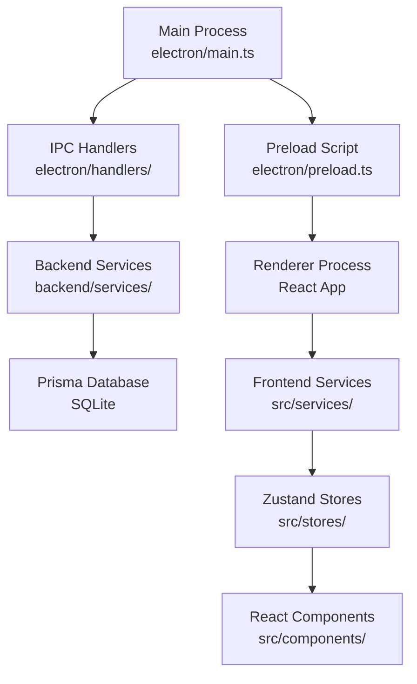
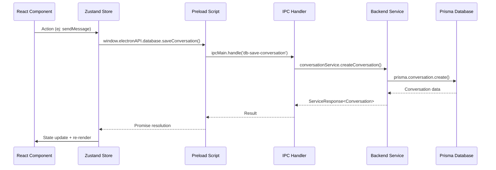
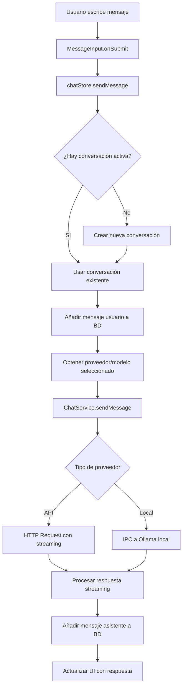
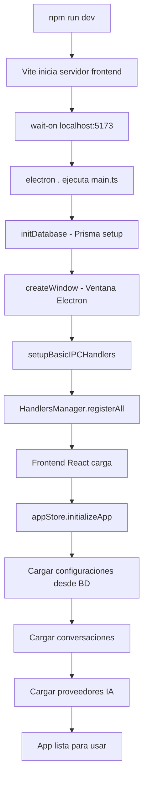

# 🏗️ Contexto y Arquitectura Completa - Boorie Prototype

## 📋 Índice

1. [Resumen General](#-resumen-general)
2. [Arquitectura Electron](#-arquitectura-electron)
3. [Estructura de Directorios](#-estructura-de-directorios)
4. [Base de Datos y Modelos](#-base-de-datos-y-modelos)
5. [Backend y Servicios](#-backend-y-servicios)
6. [Frontend React](#-frontend-react)
7. [Flujo de Datos](#-flujo-de-datos)
8. [Configuración y Build](#-configuración-y-build)
9. [Archivos Clave](#-archivos-clave)
10. [Diagramas de Arquitectura](#-diagramas-de-arquitectura)

---

## 🎯 Resumen General

**Boorie Prototype** es una aplicación de escritorio multiplataforma construida con **Electron + React + TypeScript + Prisma**. Es un cliente de chat con inteligencia artificial que soporta múltiples proveedores (OpenAI, Anthropic, Google, OpenRouter, Ollama local) con gestión avanzada de conversaciones, configuraciones persistentes y arquitectura modular.

### 🔧 Stack Tecnológico Principal

```
┌─ Frontend ─────────────────────────────────────────┐
│ React 18 + TypeScript + Vite + TailwindCSS       │
│ Zustand (Estado) + Radix UI (Componentes)        │
│ i18next (Internacionalización)                   │
└───────────────────────────────────────────────────┘
┌─ Backend/IPC ──────────────────────────────────────┐
│ Electron Main Process + Custom Handlers          │
│ TypeScript + Structured Logging                  │
└───────────────────────────────────────────────────┘
┌─ Base de Datos ────────────────────────────────────┐
│ Prisma ORM + SQLite (Local)                      │
│ Migraciones automáticas + Validación             │
└───────────────────────────────────────────────────┘
```

---

## ⚡ Arquitectura Electron

### 🏛️ Procesos y Comunicación



### 📁 Proceso Principal (Main Process)

**Archivo:** `electron/main.ts`

```typescript
// Responsabilidades principales:
✓ Gestión de ventanas de Electron
✓ Inicialización de base de datos (Prisma)
✓ Configuración de handlers IPC
✓ Gestión de rutas de archivos
✓ Auto-actualizaciones
✓ Seguridad y contexto aislado
```

**Funciones clave:**
- `initDatabase()` - Inicializa Prisma y ejecuta migraciones
- `initializeApplication()` - Setup completo de la aplicación
- `createWindow()` - Creación de ventana principal
- `setupBasicIPCHandlers()` - Handlers básicos del sistema

### 🔗 Script de Preload

**Archivo:** `electron/preload.ts`

```typescript
// API expuesta al renderer:
window.electronAPI = {
  // Sistema
  getAppVersion, getPlatform,
  
  // Base de datos
  database: {
    getSettings, setSetting,
    getConversations, saveConversation,
    getAIProviders, saveAIProvider,
    // ... más métodos
  },
  
  // Archivos
  files: { selectFile, readFile, writeFile },
  
  // IA
  ai: { ollamaQuery, openaiQuery },
  
  // Autenticación
  auth: { microsoftLogin, googleLogin },
  
  // Notificaciones y seguridad
  notifications, security
}
```

### 🎯 Proceso Renderer

**Archivo:** `src/main.tsx` (Entry point)

```typescript
// Frontend React con:
✓ Vite como bundler
✓ React Router para navegación
✓ Zustand para estado global
✓ TailwindCSS para estilos
✓ i18next para traducciones
```

---

## 📂 Estructura de Directorios

```
Boorie-Prototype/
├── 📁 electron/                    # Proceso principal Electron
│   ├── main.ts                     # Entry point principal
│   ├── preload.ts                  # Script de contexto
│   ├── handlers/                   # Handlers IPC organizados
│   │   ├── index.ts                # Gestor central de handlers
│   │   ├── conversation.handler.ts # CRUD conversaciones
│   │   ├── database.handler.ts     # Configuraciones BD
│   │   └── aiProvider.handler.ts   # Gestión proveedores IA
│   └── tsconfig.json               # Config TypeScript Electron
│
├── 📁 backend/                     # Lógica de negocio
│   ├── index.ts                    # Barrel export
│   ├── models/                     # Interfaces y tipos
│   │   └── index.ts                # Definiciones TypeScript
│   ├── services/                   # Servicios de negocio
│   │   ├── index.ts                # Barrel export servicios
│   │   ├── database.service.ts     # Operaciones Prisma
│   │   ├── conversation.service.ts # Lógica conversaciones
│   │   └── aiProvider.service.ts   # Gestión proveedores
│   └── utils/                      # Utilidades compartidas
│       ├── logger.ts               # Sistema de logging
│       └── validation.ts           # Validaciones de datos
│
├── 📁 src/                         # Frontend React
│   ├── main.tsx                    # Entry point React
│   ├── App.tsx                     # Componente raíz
│   ├── components/                 # Componentes UI
│   │   ├── chat/                   # Interfaz de chat
│   │   │   ├── ChatArea.tsx        # Área principal
│   │   │   ├── ChatHeader.tsx      # Header conversación
│   │   │   ├── ChatLayout.tsx      # Layout principal
│   │   │   ├── MessageBubble.tsx   # Burbuja mensaje
│   │   │   ├── MessageInput.tsx    # Input de mensaje
│   │   │   ├── MessageList.tsx     # Lista mensajes
│   │   │   ├── ModelSelector.tsx   # Selector modelo IA
│   │   │   ├── Sidebar.tsx         # Barra lateral
│   │   │   ├── TypewriterText.tsx  # Efecto typewriter
│   │   │   └── TypingIndicator.tsx # Indicador escribiendo
│   │   ├── settings/               # Paneles configuración
│   │   │   ├── SettingsPanel.tsx   # Panel principal
│   │   │   ├── AIConfigurationPanel.tsx # Config IA
│   │   │   └── tabs/               # Pestañas settings
│   │   │       ├── GeneralTab.tsx  # Config general
│   │   │       ├── AccountsTab.tsx # Cuentas conectadas
│   │   │       └── index.ts        # Barrel export
│   │   ├── calendar/               # (Futuro) Integración calendario
│   │   ├── email/                  # (Futuro) Integración email
│   │   ├── rag/                    # (Futuro) RAG/Documentos
│   │   └── TitleBarOverlay.tsx     # Barra título personalizada
│   ├── services/                   # Servicios frontend
│   │   ├── database/               # Interface BD desde frontend
│   │   │   └── index.ts            # Wrapper electronAPI
│   │   ├── chat/                   # Servicios chat IA
│   │   │   ├── index.ts            # Orquestador chat
│   │   │   ├── types.ts            # Tipos chat
│   │   │   ├── openai.ts           # Cliente OpenAI
│   │   │   ├── anthropic.ts        # Cliente Anthropic
│   │   │   ├── google.ts           # Cliente Google/Gemini
│   │   │   └── openrouter.ts       # Cliente OpenRouter
│   │   └── ai/                     # Configuración proveedores
│   │       └── providers.ts        # Lista proveedores disponibles
│   ├── stores/                     # Estado global Zustand
│   │   ├── appStore.ts             # Estado aplicación
│   │   ├── chatStore.ts            # Estado conversaciones
│   │   ├── aiConfigStore.ts        # Config proveedores IA
│   │   └── preferencesStore.ts     # Preferencias usuario
│   ├── hooks/                      # Custom hooks React
│   │   └── useOnClickOutside.ts    # Hook click afuera
│   ├── types/                      # Definiciones TypeScript
│   │   └── electron.d.ts           # Tipos para electronAPI
│   ├── locales/                    # Traducciones i18n
│   │   ├── en.json                 # Inglés
│   │   ├── es.json                 # Español
│   │   └── ca.json                 # Catalán
│   ├── utils/                      # Utilidades frontend
│   │   └── cn.ts                   # Utility clsx/tailwind-merge
│   └── i18n.ts                     # Configuración i18next
│
├── 📁 prisma/                      # Base de datos
│   └── schema.prisma               # Esquema base de datos
│
├── 📁 historial/                   # Documentación histórica
│   ├── README_V1_Chat_Settings.md  # Historial cambios V1
│   ├── README_v2_Chat_Settings.md  # Historial cambios V2
│   ├── ...                         # ... más versiones
│   └── contexto-de-la-app.md       # Este documento
│
├── 📁 dist/                        # Build compilado
├── 📁 node_modules/                # Dependencias npm
│
├── 📄 package.json                 # Configuración npm + scripts
├── 📄 package-lock.json            # Lock de dependencias
├── 📄 tsconfig.json                # Config TypeScript global
├── 📄 tsconfig.node.json           # Config TypeScript Node
├── 📄 vite.config.ts               # Configuración Vite
├── 📄 tailwind.config.js           # Config TailwindCSS
├── 📄 postcss.config.js            # Config PostCSS
└── 📄 .gitignore                   # Archivos ignorados Git
```

### 📊 Métricas de Código

```
📈 Frontend React:     ~2,800 líneas TypeScript/TSX
📈 Backend Services:   ~1,200 líneas TypeScript
📈 Electron Handlers: ~800 líneas TypeScript
📈 Configuraciones:   ~400 líneas JSON/JS
📈 Documentación:     ~500 líneas Markdown
────────────────────────────────────────────────
📊 Total:             ~5,700 líneas de código
```

---

## 🗄️ Base de Datos y Modelos

### 🎯 Esquema Prisma Actualizado

**Archivo:** `prisma/schema.prisma`

```prisma
generator client {
  provider      = "prisma-client-js"
  binaryTargets = ["native", "windows", "debian-openssl-3.0.x"]
}

datasource db {
  provider = "sqlite"
  url      = env("DATABASE_URL")
}

// 🗨️ CONVERSACIONES
model Conversation {
  id          String   @id @default(cuid())
  title       String
  model       String   // Modelo IA usado
  provider    String   // Proveedor IA
  createdAt   DateTime @default(now())
  updatedAt   DateTime @updatedAt

  messages    Message[] // ⭐ NUEVA: Relación a mensajes

  @@map("conversations")
}

// 💬 MENSAJES (NUEVA TABLA SEPARADA)
model Message {
  id             String   @id @default(cuid())
  conversationId String
  role           String   // 'user' | 'assistant' | 'system'
  content        String
  timestamp      DateTime @default(now())
  metadata       String?  // JSON metadata (tokens, fuentes, etc.)
  createdAt      DateTime @default(now())

  conversation   Conversation @relation(fields: [conversationId], references: [id], onDelete: Cascade)

  @@map("messages")
}

// 🤖 PROVEEDORES IA
model AIProvider {
  id               String   @id @default(cuid())
  name             String   @unique
  type             String   // 'local' | 'api'
  apiKey           String?  // Clave API encriptada
  isActive         Boolean  @default(false)
  isConnected      Boolean  @default(false)
  lastTestResult   String?  // 'success' | 'error' | null
  lastTestMessage  String?
  config           String?  // JSON configuración adicional
  createdAt        DateTime @default(now())
  updatedAt        DateTime @updatedAt

  models           AIModel[] // Relación modelos

  @@map("ai_providers")
}

// 🧠 MODELOS IA
model AIModel {
  id          String   @id @default(cuid())
  providerId  String
  modelName   String
  modelId     String
  isDefault   Boolean  @default(false)
  isAvailable Boolean  @default(true)
  isSelected  Boolean  @default(false)
  description String?
  metadata    String?  // JSON metadata específica
  createdAt   DateTime @default(now())
  updatedAt   DateTime @updatedAt

  provider    AIProvider @relation(fields: [providerId], references: [id], onDelete: Cascade)

  @@unique([providerId, modelId])
  @@map("ai_models")
}

// ⚙️ CONFIGURACIONES
model AppSetting {
  id        String   @id @default(cuid())
  key       String   @unique
  value     String
  category  String?  // 'general', 'ai', 'theme', etc.
  createdAt DateTime @default(now())
  updatedAt DateTime @updatedAt

  @@map("app_settings")
}

// 📄 DOCUMENTOS (RAG - Futuro)
model Document {
  id          String   @id @default(cuid())
  filename    String
  filepath    String
  content     String
  metadata    String?
  embeddings  String?
  createdAt   DateTime @default(now())
  updatedAt   DateTime @updatedAt

  chunks DocumentChunk[]

  @@map("documents")
}

model DocumentChunk {
  id         String   @id @default(cuid())
  documentId String
  content    String
  embedding  String?
  metadata   String?
  startPos   Int?
  endPos     Int?
  createdAt  DateTime @default(now())

  document Document @relation(fields: [documentId], references: [id], onDelete: Cascade)

  @@map("document_chunks")
}

// 🔐 TOKENS AUTENTICACIÓN
model AuthToken {
  id          String   @id @default(cuid())
  provider    String
  tokenType   String
  accessToken String
  refreshToken String?
  expiresAt   DateTime?
  createdAt   DateTime @default(now())
  updatedAt   DateTime @updatedAt

  @@unique([provider, tokenType])
  @@map("auth_tokens")
}

// 📧 MENSAJES EMAIL (Futuro)
model EmailMessage {
  id          String   @id @default(cuid())
  provider    String
  messageId   String
  subject     String
  from        String
  to          String   // JSON array
  cc          String?
  bcc         String?
  body        String
  htmlBody    String?
  attachments String?  // JSON array
  isRead      Boolean  @default(false)
  isImportant Boolean  @default(false)
  receivedAt  DateTime
  createdAt   DateTime @default(now())
  updatedAt   DateTime @updatedAt

  @@unique([provider, messageId])
  @@map("email_messages")
}

// 📅 EVENTOS CALENDARIO (Futuro)
model CalendarEvent {
  id          String   @id @default(cuid())
  provider    String
  eventId     String
  title       String
  description String?
  location    String?
  startTime   DateTime
  endTime     DateTime
  isAllDay    Boolean  @default(false)
  attendees   String?  // JSON array
  organizer   String?
  createdAt   DateTime @default(now())
  updatedAt   DateTime @updatedAt

  @@unique([provider, eventId])
  @@map("calendar_events")
}
```

### 🔄 Características de la Base de Datos

```typescript
✅ Eliminación en cascada: Al eliminar conversación → se eliminan mensajes automáticamente
✅ Índices únicos: Previene duplicados en proveedores y modelos
✅ Timestamps automáticos: createdAt/updatedAt gestionados por Prisma
✅ Validación de tipos: TypeScript + validación en runtime
✅ Migraciones automáticas: prisma db push en desarrollo
✅ Multiplataforma: SQLite compatible Windows/Linux/macOS
```

---

## 🔧 Backend y Servicios

### 🏗️ Arquitectura de Servicios

```
📦 backend/services/
├── 🗄️ database.service.ts     # Capa de acceso a datos Prisma
├── 💬 conversation.service.ts # Lógica de negocio conversaciones
└── 🤖 aiProvider.service.ts   # Gestión proveedores IA

📦 electron/handlers/
├── 🔧 index.ts                # HandlerManager central
├── 💬 conversation.handler.ts # IPC handlers conversaciones
├── 🗄️ database.handler.ts     # IPC handlers configuraciones
└── 🤖 aiProvider.handler.ts   # IPC handlers proveedores IA
```

### 🗄️ DatabaseService

**Archivo:** `backend/services/database.service.ts`

```typescript
export class DatabaseService {
  private prismaClient: PrismaClient
  
  // 💬 Operaciones Conversación
  async getConversations(): Promise<IServiceResponse<IConversation[]>>
  async getConversationById(id: string): Promise<IServiceResponse<IConversation>>
  async createConversation(data: ICreateConversationData): Promise<IServiceResponse<IConversation>>
  async updateConversation(id: string, updates: IUpdateConversationData): Promise<IServiceResponse<IConversation>>
  async deleteConversation(id: string): Promise<IServiceResponse<boolean>>
  
  // 💬 Operaciones Mensaje (NUEVO)
  async createMessage(data: { conversationId: string, role: string, content: string, metadata?: any }): Promise<IServiceResponse<any>>
  
  // 🤖 Operaciones Proveedor IA
  async getAIProviders(): Promise<IServiceResponse<IAIProvider[]>>
  async createAIProvider(data: ICreateAIProviderData): Promise<IServiceResponse<IAIProvider>>
  async updateAIProvider(id: string, updates: IUpdateAIProviderData): Promise<IServiceResponse<IAIProvider>>
  
  // 🧠 Operaciones Modelo IA
  async getAIModels(providerId?: string): Promise<IServiceResponse<IAIModel[]>>
  async createAIModel(data: any): Promise<IServiceResponse<IAIModel>>
  async deleteAIModelsByProvider(providerId: string): Promise<IServiceResponse<boolean>>
  
  // ⚙️ Operaciones Configuración
  async getSetting(key: string): Promise<IServiceResponse<IAppSetting>>
  async setSetting(key: string, value: string, category?: string): Promise<IServiceResponse<IAppSetting>>
  async getSettings(category?: string): Promise<IServiceResponse<IAppSetting[]>>
}
```

### 💬 ConversationService

**Archivo:** `backend/services/conversation.service.ts`

```typescript
export class ConversationService {
  // 🔧 Gestión Conversaciones
  async getAllConversations(): Promise<IServiceResponse<IConversation[]>>
  async getConversationById(id: string): Promise<IServiceResponse<IConversation>>
  async createConversation(data: ICreateConversationData): Promise<IServiceResponse<IConversation>>
  async updateConversation(id: string, updates: IUpdateConversationData): Promise<IServiceResponse<IConversation>>
  async deleteConversation(id: string): Promise<IServiceResponse<boolean>>
  
  // 💬 Gestión Mensajes (ACTUALIZADO)
  async addMessageToConversation(conversationId: string, message: Omit<IMessage, 'id' | 'timestamp'>): Promise<IServiceResponse<IConversation>>
  async updateConversationTitle(id: string, title: string): Promise<IServiceResponse<IConversation>>
  async updateConversationModel(id: string, model: string, provider: string): Promise<IServiceResponse<IConversation>>
  
  // 🛡️ Validaciones privadas
  private validateConversationData(data: ICreateConversationData): void
  private validateMessages(messages: IMessage[]): void
  private validateMessage(message: Partial<IMessage>): void
  private generateMessageId(): string
  private generateTitleFromMessage(content: string): string
}
```

### 🎯 Handlers IPC

**Archivo:** `electron/handlers/conversation.handler.ts`

```typescript
export class ConversationHandler {
  // 📡 Registra todos los handlers IPC
  private registerHandlers(): void {
    ipcMain.handle('db-get-conversations', async () => { /* ... */ })
    ipcMain.handle('db-get-conversation', async (event, id: string) => { /* ... */ })
    ipcMain.handle('db-save-conversation', async (event, data: ICreateConversationData) => { /* ... */ })
    ipcMain.handle('db-update-conversation', async (event, id: string, updates: IUpdateConversationData) => { /* ... */ })
    ipcMain.handle('db-delete-conversation', async (event, id: string) => { /* ... */ })
    ipcMain.handle('db-add-message-to-conversation', async (event, conversationId: string, message: Omit<IMessage, 'id' | 'timestamp'>) => { /* ... */ })
    ipcMain.handle('db-update-conversation-title', async (event, id: string, title: string) => { /* ... */ })
    ipcMain.handle('db-update-conversation-model', async (event, id: string, model: string, provider: string) => { /* ... */ })
  }
}
```

### 🔍 Sistema de Logging

**Archivo:** `backend/utils/logger.ts`

```typescript
// 🎯 Loggers especializados
export const appLogger = createLogger('App')           // Aplicación general
export const databaseLogger = createLogger('Database') // Base de datos
export const conversationLogger = createLogger('Conversation') // Conversaciones
export const aiProviderLogger = createLogger('AIProvider')     // Proveedores IA

// 📊 Niveles de log: debug, info, success, warn, error
// 🎨 Colores automáticos según nivel
// 📝 Contexto estructurado con metadatos
```

---

## ⚛️ Frontend React

### 🏗️ Arquitectura de Components

```
📁 src/components/
├── 💬 chat/                    # Interfaz principal de chat
│   ├── ChatLayout.tsx          # Layout principal con sidebar
│   ├── ChatArea.tsx            # Área de chat activa
│   ├── ChatHeader.tsx          # Header con título y acciones
│   ├── Sidebar.tsx             # Lista conversaciones + controles
│   ├── MessageList.tsx         # Lista scrolleable de mensajes
│   ├── MessageBubble.tsx       # Burbuja individual de mensaje
│   ├── MessageInput.tsx        # Input mensaje + envío
│   ├── ModelSelector.tsx       # Selector modelo/proveedor IA
│   ├── TypewriterText.tsx      # Efecto typewriter para respuestas
│   └── TypingIndicator.tsx     # Indicador "AI escribiendo..."
├── ⚙️ settings/                # Paneles de configuración
│   ├── SettingsPanel.tsx       # Panel principal con tabs
│   ├── AIConfigurationPanel.tsx # Configuración proveedores IA
│   └── tabs/                   # Pestañas individuales
│       ├── GeneralTab.tsx      # Configuración general
│       └── AccountsTab.tsx     # Cuentas conectadas
├── 🎯 TitleBarOverlay.tsx      # Barra título personalizada
├── 📅 calendar/                # (Futuro) Integración calendario
├── 📧 email/                   # (Futuro) Integración email
└── 📄 rag/                     # (Futuro) RAG/Documentos
```

### 🗄️ Estado Global con Zustand

**Archivo:** `src/stores/chatStore.ts`

```typescript
interface ChatStore {
  // 📊 Estado
  conversations: Conversation[]
  activeConversationId: string | null
  isLoading: boolean
  streamingMessage: string
  
  // 🔧 Acciones Conversación
  setActiveConversation: (id: string | null) => void
  loadConversations: () => Promise<void>
  createNewConversation: () => Promise<string>
  deleteConversation: (id: string) => Promise<void>
  updateConversationTitle: (id: string, title: string) => Promise<void>
  
  // 💬 Acciones Mensaje
  sendMessage: (content: string) => Promise<void>
  addMessageToConversation: (conversationId: string, message: Omit<Message, 'id' | 'timestamp'>) => Promise<void>
  
  // 🎯 Streaming IA
  startStreaming: () => void
  updateStreamingMessage: (chunk: string) => void
  finishStreaming: () => void
}
```

**Archivo:** `src/stores/aiConfigStore.ts`

```typescript
interface AIConfigStore {
  // 📊 Estado
  providers: AIProvider[]
  models: AIModel[]
  selectedProvider: AIProvider | null
  selectedModel: AIModel | null
  isLoading: boolean
  
  // 🔧 Acciones Proveedor
  loadProviders: () => Promise<void>
  saveProvider: (data: Omit<AIProvider, 'id' | 'createdAt' | 'updatedAt'>) => Promise<void>
  updateProvider: (id: string, updates: Partial<AIProvider>) => Promise<void>
  testProviderConnection: (id: string) => Promise<boolean>
  
  // 🧠 Acciones Modelo
  loadModels: (providerId?: string) => Promise<void>
  setSelectedModel: (provider: AIProvider, model: AIModel) => void
  refreshProviderModels: (providerId: string) => Promise<void>
}
```

### 🎨 Componentes Clave

#### 💬 ChatArea Component

```typescript
// src/components/chat/ChatArea.tsx
export function ChatArea() {
  const { 
    conversations, 
    activeConversationId, 
    sendMessage, 
    isLoading, 
    streamingMessage 
  } = useChatStore()
  
  const activeConversation = conversations.find(c => c.id === activeConversationId)
  
  return (
    <div className="flex flex-col h-full">
      <ChatHeader conversation={activeConversation} />
      
      <MessageList 
        messages={activeConversation?.messages || []}
        isLoading={isLoading}
        streamingMessage={streamingMessage}
      />
      
      <MessageInput 
        onSendMessage={sendMessage}
        disabled={isLoading}
      />
    </div>
  )
}
```

#### 🗨️ MessageBubble Component

```typescript
// src/components/chat/MessageBubble.tsx
export function MessageBubble({ message, isStreaming }: MessageBubbleProps) {
  const isUser = message.role === 'user'
  
  return (
    <div className={`flex ${isUser ? 'justify-end' : 'justify-start'} mb-4`}>
      <div className={`
        max-w-[80%] p-3 rounded-lg
        ${isUser 
          ? 'bg-blue-500 text-white' 
          : 'bg-gray-100 text-gray-900 dark:bg-gray-800 dark:text-gray-100'
        }
      `}>
        {/* 📝 Contenido del mensaje */}
        <div className="whitespace-pre-wrap break-words">
          {isStreaming ? (
            <TypewriterText text={message.content} />
          ) : (
            message.content
          )}
        </div>
        
        {/* 📊 Metadata para mensajes del asistente */}
        {message.metadata && !isUser && (
          <div className="flex items-center space-x-2 mt-2 text-xs opacity-70">
            <span>{message.metadata.provider}</span>
            <span>{message.metadata.model}</span>
            {message.metadata.tokens && (
              <span>{message.metadata.tokens} tokens</span>
            )}
          </div>
        )}
        
        {/* 🕒 Timestamp */}
        <div className="text-xs opacity-50 mt-1">
          {new Date(message.timestamp).toLocaleTimeString()}
        </div>
      </div>
    </div>
  )
}
```

### 🌐 Servicios de Chat IA

**Archivo:** `src/services/chat/index.ts`

```typescript
// 🎯 Orquestador principal de chat
export class ChatService {
  async sendMessage(
    provider: AIProvider,
    model: AIModel,
    messages: Message[],
    onStreamChunk?: (chunk: string) => void
  ): Promise<string> {
    
    switch (provider.type) {
      case 'openai':
        return this.openaiService.sendMessage(model, messages, onStreamChunk)
      case 'anthropic':
        return this.anthropicService.sendMessage(model, messages, onStreamChunk)
      case 'google':
        return this.googleService.sendMessage(model, messages, onStreamChunk)
      case 'openrouter':
        return this.openrouterService.sendMessage(model, messages, onStreamChunk)
      case 'ollama':
        return window.electronAPI.ai.ollamaQuery(model.modelId, this.formatMessages(messages))
      default:
        throw new Error(`Proveedor no soportado: ${provider.type}`)
    }
  }
}
```

---

## 🔄 Flujo de Datos

### 📡 Comunicación IPC



### 💬 Flujo de Envío de Mensaje



### 🔧 Inicialización de Aplicación



---

## ⚙️ Configuración y Build

### 📦 Scripts Principales

**package.json:**

```json
{
  "scripts": {
    "dev": "concurrently \"npm run dev:vite\" \"npm run dev:electron\"",
    "dev:vite": "vite",
    "dev:electron": "wait-on http://localhost:5173 && electron .",
    
    "build": "tsc -b && vite build",
    "build:electron": "tsc -p electron/tsconfig.json",
    
    "db:generate": "prisma generate",
    "db:push": "prisma db push",
    "db:migrate": "prisma migrate dev",
    
    "preview": "vite preview",
    "electron": "electron .",
    "pack": "electron-builder",
    "dist": "electron-builder --publish=never"
  }
}
```

### 🏗️ Configuración Vite

**vite.config.ts:**

```typescript
export default defineConfig({
  plugins: [react()],
  base: './',
  build: {
    outDir: 'dist',
    assetsDir: 'assets',
    emptyOutDir: true
  },
  server: {
    port: 5173,
    host: true
  }
})
```

### 🎯 Configuración TypeScript

**tsconfig.json (Frontend):**

```json
{
  "compilerOptions": {
    "target": "ES2020",
    "lib": ["ES2020", "DOM", "DOM.Iterable"],
    "module": "ESNext",
    "skipLibCheck": true,
    
    "moduleResolution": "bundler",
    "allowImportingTsExtensions": true,
    "resolveJsonModule": true,
    "isolatedModules": true,
    "noEmit": true,
    "jsx": "react-jsx",
    
    "strict": true,
    "noUnusedLocals": true,
    "noUnusedParameters": true,
    "noFallthroughCasesInSwitch": true
  },
  "include": ["src"],
  "references": [{ "path": "./tsconfig.node.json" }]
}
```

**electron/tsconfig.json (Electron):**

```json
{
  "compilerOptions": {
    "target": "ES2020",
    "module": "CommonJS",
    "outDir": "../dist/electron",
    "strict": true,
    "esModuleInterop": true,
    "skipLibCheck": true,
    "forceConsistentCasingInFileNames": true
  },
  "include": ["**/*"],
  "exclude": ["node_modules", "dist"]
}
```

---

## 📋 Archivos Clave

### 🔑 Archivos de Configuración Críticos

| Archivo | Propósito | Descripción |
|---------|-----------|-------------|
| `package.json` | Dependencias y scripts | Define dependencias, scripts npm y metadatos |
| `vite.config.ts` | Build frontend | Configuración bundler Vite para React |
| `tsconfig.json` | TypeScript frontend | Configuración compilador TS frontend |
| `electron/tsconfig.json` | TypeScript Electron | Configuración compilador TS Electron |
| `tailwind.config.js` | Estilos CSS | Configuración framework TailwindCSS |
| `prisma/schema.prisma` | Base de datos | Esquema completo de base de datos |
| `.gitignore` | Control de versiones | Archivos excluidos de Git |

### 🎯 Archivos de Entry Points

| Archivo | Tipo | Descripción |
|---------|------|-------------|
| `electron/main.ts` | Main Process | Entry point proceso principal Electron |
| `electron/preload.ts` | Preload Script | Contexto seguro para IPC |
| `src/main.tsx` | React App | Entry point aplicación React |
| `src/App.tsx` | Root Component | Componente raíz React |

### 🔧 Archivos de Servicios Core

| Archivo | Responsabilidad |
|---------|----------------|
| `backend/services/database.service.ts` | Operaciones Prisma |
| `backend/services/conversation.service.ts` | Lógica conversaciones |
| `electron/handlers/conversation.handler.ts` | IPC conversaciones |
| `src/stores/chatStore.ts` | Estado global chat |
| `src/services/chat/index.ts` | Orquestador IA |

### 📝 Archivos de Tipos

| Archivo | Tipos Definidos |
|---------|-----------------|
| `backend/models/index.ts` | Interfaces backend |
| `src/types/electron.d.ts` | Tipos electronAPI |
| `src/services/chat/types.ts` | Tipos servicios chat |

---

## 🎨 Diagramas de Arquitectura

### 🏗️ Arquitectura General

```
┌─────────────────────────────────────────────────────────┐
│                    APLICACIÓN BOORIE                     │
├─────────────────────────────────────────────────────────┤
│                                                         │
│  ┌─ FRONTEND (React + TypeScript) ─────────────────┐   │
│  │                                                 │   │
│  │  React Components                               │   │
│  │  ├── 💬 Chat Interface                          │   │
│  │  ├── ⚙️ Settings Panels                         │   │
│  │  └── 🎯 Utility Components                      │   │
│  │                                                 │   │
│  │  Zustand Stores                                 │   │
│  │  ├── 💬 chatStore (Conversaciones)              │   │
│  │  ├── 🤖 aiConfigStore (Proveedores)             │   │
│  │  ├── ⚙️ appStore (Configuración)                │   │
│  │  └── 🎨 preferencesStore (UI)                   │   │
│  │                                                 │   │
│  │  Services Layer                                 │   │
│  │  ├── 🗄️ Database Service (IPC Wrapper)          │   │
│  │  └── 🤖 Chat Services (IA Providers)            │   │
│  │                                                 │   │
│  └─────────────────────────────────────────────────┘   │
│                         │                               │
│                    ┌─ IPC ─┐                            │
│                    │       │                            │
│  ┌─ ELECTRON MAIN PROCESS ─────────────────────────┐   │
│  │                 │       │                       │   │
│  │  ┌─ Preload ────▼───────▼─┐                     │   │
│  │  │ electronAPI Bridge     │                     │   │
│  │  │ - Seguridad            │                     │   │
│  │  │ - Contexto aislado     │                     │   │
│  │  └────────────────────────┘                     │   │
│  │                                                 │   │
│  │  IPC Handlers                                   │   │
│  │  ├── 💬 Conversation Handler                     │   │
│  │  ├── 🗄️ Database Handler                        │   │
│  │  └── 🤖 AI Provider Handler                     │   │
│  │                                                 │   │
│  │  Backend Services                               │   │
│  │  ├── 🗄️ Database Service                        │   │
│  │  ├── 💬 Conversation Service                    │   │
│  │  └── 🤖 AI Provider Service                     │   │
│  │                                                 │   │
│  └─────────────────────────────────────────────────┘   │
│                         │                               │
│                         ▼                               │
│  ┌─ BASE DE DATOS (Prisma + SQLite) ──────────────┐   │
│  │                                                 │   │
│  │  Tablas Principales:                           │   │
│  │  ├── 💬 conversations                          │   │
│  │  ├── 📝 messages (NUEVO - Separado)             │   │
│  │  ├── 🤖 ai_providers                           │   │
│  │  ├── 🧠 ai_models                              │   │
│  │  ├── ⚙️ app_settings                           │   │
│  │  └── 🔐 auth_tokens                            │   │
│  │                                                 │   │
│  │  Características:                              │   │
│  │  ✅ Eliminación en cascada                      │   │
│  │  ✅ Validación de tipos                         │   │
│  │  ✅ Migraciones automáticas                     │   │
│  │  ✅ Índices únicos                             │   │
│  │                                                 │   │
│  └─────────────────────────────────────────────────┘   │
│                                                         │
└─────────────────────────────────────────────────────────┘
```

### 🔄 Flujo de Datos en Detalle

```
┌─ USUARIO INTERACTÚA ────────────────────────────────────┐
│                                                         │
│  1. Usuario envía mensaje                               │
│     ↓                                                   │
│  2. MessageInput.onSubmit()                             │
│     ↓                                                   │
│  3. chatStore.sendMessage()                             │
│     ↓                                                   │
│  4. window.electronAPI.database.saveConversation()     │
│     ↓                                                   │
│  5. IPC → conversation.handler.ts                       │
│     ↓                                                   │
│  6. ConversationService.createConversation()           │
│     ↓                                                   │
│  7. DatabaseService.createConversation()               │
│     ↓                                                   │
│  8. prisma.conversation.create()                       │
│     ↓                                                   │
│  9. ChatService.sendMessage() → IA Provider            │
│     ↓                                                   │
│  10. DatabaseService.createMessage() (NUEVO)           │
│     ↓                                                   │
│  11. prisma.message.create()                           │
│     ↓                                                   │
│  12. Estado actualizado → React re-render              │
│                                                         │
└─────────────────────────────────────────────────────────┘
```

### 🗂️ Estructura de Base de Datos Visual

```
conversations                    messages (NUEVA TABLA)
┌──────────────────┐            ┌──────────────────────┐
│ id (PK)          │◄──────────┤ conversationId (FK)  │
│ title            │ 1      ∞   │ id (PK)              │
│ model            │            │ role                 │
│ provider         │            │ content              │
│ createdAt        │            │ timestamp            │
│ updatedAt        │            │ metadata (JSON)      │
└──────────────────┘            │ createdAt            │
                                └──────────────────────┘

ai_providers                     ai_models
┌──────────────────┐            ┌──────────────────────┐
│ id (PK)          │◄──────────┤ providerId (FK)      │
│ name (UNIQUE)    │ 1      ∞   │ id (PK)              │
│ type             │            │ modelName            │
│ apiKey           │            │ modelId              │
│ isActive         │            │ isDefault            │
│ isConnected      │            │ isAvailable          │
│ lastTestResult   │            │ isSelected           │
│ config (JSON)    │            │ description          │
│ createdAt        │            │ metadata (JSON)      │
│ updatedAt        │            │ createdAt            │
└──────────────────┘            │ updatedAt            │
                                └──────────────────────┘

app_settings
┌──────────────────┐
│ id (PK)          │
│ key (UNIQUE)     │
│ value            │
│ category         │
│ createdAt        │
│ updatedAt        │
└──────────────────┘
```

---

## 🎯 Conclusión

Esta documentación proporciona una visión completa de la arquitectura de **Boorie Prototype**. La aplicación está construida con una arquitectura sólida, modular y escalable que separa claramente las responsabilidades:

### ✅ Puntos Fuertes de la Arquitectura

1. **🔒 Seguridad**: Contexto aislado Electron con IPC seguro
2. **📊 Escalabilidad**: Servicios modulares y base de datos normalizada  
3. **🛠️ Mantenibilidad**: Código TypeScript tipado y logging estructurado
4. **⚡ Performance**: Streaming de respuestas IA y estado optimizado
5. **🔄 Flexibilidad**: Soporte múltiples proveedores IA fácilmente extensible

### 🚀 Próximos Pasos Potenciales

- **📧 Integración Email**: Usar modelos EmailMessage existentes
- **📅 Integración Calendario**: Implementar CalendarEvent y sincronización  
- **📄 RAG/Documentos**: Activar DocumentChunk para búsqueda semántica
- **🌐 Multi-idioma**: Expandir locales existentes (en/es/ca)
- **🔐 Autenticación**: Implementar AuthToken para OAuth providers

La base está preparada para todas estas funcionalidades futuras manteniendo la estabilidad y performance actuales.

---

**📝 Documento generado automáticamente - Versión 1.0**  
**🗓️ Fecha:** 29 de Junio, 2025  
**👨‍💻 Contexto:** Post-separación tabla mensajes + arquitectura completa