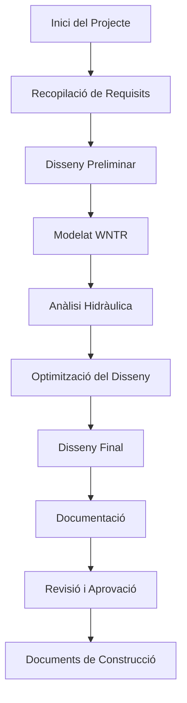

# Guia de Gestió de Projectes

## Descripció General

Boorie proporciona eines completes de gestió de projectes dissenyades específicament per a fluxos de treball d'enginyeria hidràulica. Aquesta guia cobreix la creació de projectes, col·laboració en equip, gestió de documents i control de versions.

## Creació de Projectes

### 1. Configuració de Nou Projecte

#### Plantilles de Projecte

**Sistema de Distribució d'Aigua**
```json
{
  "template": "water_distribution",
  "designCriteria": {
    "minPressure": 20,
    "maxPressure": 50,
    "maxVelocity": 3.0,
    "peakFactor": 2.5,
    "fireFlowDuration": 120
  },
  "materials": ["PVC", "HDPE", "Ductile_Iron"],
  "analysisTypes": ["hydraulic", "water_quality", "energy"]
}
```

**Recol·lecció d'Aigües Residuals**
```json
{
  "template": "wastewater_collection",
  "designCriteria": {
    "minSlope": 0.5,
    "maxVelocity": 5.0,
    "minVelocity": 0.6,
    "peakFactor": 4.0,
    "infiltration": 0.1
  }
}
```

### 2. Configuració del Projecte

#### Informació Bàsica
- **Nom del Projecte**: Identificador descriptiu
- **Codi del Projecte**: Codi alfanumèric únic
- **Client**: Organització o individu
- **Ubicació**: Informació geogràfica amb coordenades
- **Cronograma**: Data d'inici, fites, data de finalització
- **Pressupost**: Pressupost total i assignacions per fase

## Col·laboració en Equip

### 1. Rols d'Usuari i Permisos

#### Matriu de Permisos
| Acció | Propietari | Admin | Enginyer | Revisor | Visor |
|-------|-----------|-------|----------|---------|-------|
| Veure Projecte | Sí | Sí | Sí | Sí | Sí |
| Editar Xarxa | Sí | Sí | Sí | No | No |
| Executar Simulacions | Sí | Sí | Sí | No | No |
| Generar Informes | Sí | Sí | Sí | Sí | No |
| Gestionar Equip | Sí | Sí | No | No | No |
| Eliminar Projecte | Sí | No | No | No | No |
| Exportar Dades | Sí | Sí | Sí | Sí | No |

### 2. Gestió d'Equip

#### Comunicació de l'Equip
- **Comentaris**: Adjuntar notes a components específics
- **Mencions**: Notificar a membres de l'equip amb @usuari
- **Notificacions**: Actualitzacions en temps real sobre canvis del projecte
- **Feed d'Activitat**: Registre cronològic d'activitat del projecte

### 3. Col·laboració en Temps Real

#### Resolució de Conflictes
- **Fusió Automàtica**: Per a canvis no conflictius
- **Resolució Manual**: Quan els conflictes requereixen decisió humana
- **Ramificació de Versions**: Crear branques per a canvis experimentals
- **Reversió**: Tornar a l'estat estable anterior

## Gestió de Documents

### 1. Tipus de Documents

#### Documents Tècnics
- Plànols de disseny, esquemàtics de xarxa
- Especificacions tècniques i estàndards
- Càlculs i anàlisi d'enginyeria
- Resultats d'anàlisi i recomanacions
- Fotos del lloc i imatges d'equips

#### Documents Regulatoris
- Permisos de construcció i operació
- Codis i regulacions aplicables
- Aprovacions governamentals i del client

### 2. Organització de Documents

#### Estructura de Carpetes
```
Arrel del Projecte/
├── 01-Disseny/
│   ├── Plànols/
│   ├── Especificacions/
│   └── Càlculs/
├── 02-Anàlisi/
│   ├── Models-WNTR/
│   ├── Resultats-Simulació/
│   └── Informes/
├── 03-Regulatori/
│   ├── Permisos/
│   ├── Estàndards/
│   └── Aprovacions/
├── 04-Construcció/
│   ├── As-Built/
│   ├── Proves/
│   └── Posada-en-Marxa/
└── 05-Operacions/
    ├── Manuals/
    ├── Manteniment/
    └── Capacitació/
```

### 3. Control de Versions

#### Seguiment de Canvis
- **Versionat Automàtic**: Nova versió a cada desament
- **Versionat Manual**: Creació explícita de versions
- **Comparació de Canvis**: Diferències visuals entre versions
- **Punts de Restauració**: Reversió a qualsevol versió anterior

## Analítiques del Projecte

### 1. Seguiment de Progrés

#### Indicadors Clau de Rendiment
- Percentatge de completació per fase
- Revisions pendents i problemes oberts
- Dies restants i progrés de fites
- Ús de pressupost i utilització de l'equip

#### Visualització de Progrés
- **Diagrames de Gantt**: Visualització de cronograma i dependències
- **Gràfics de Burndown**: Finalització de treball al llarg del temps
- **Assignació de Recursos**: Càrrega de treball de membres de l'equip
- **Seguiment de Pressupost**: Despesa real vs. planificada

## Gestió de Fluxos de Treball

### 1. Procés de Disseny



### 2. Procés de Revisió

#### Tipus de Revisió
- **Revisió Tècnica**: Precisió d'enginyeria i compliment d'estàndards
- **Revisió per Parells**: Verificació creuada per altres enginyers
- **Revisió del Client**: Aprovació i retroalimentació de l'interessat
- **Revisió Regulatòria**: Compliment de codis i permisos

## Funcions Avançades

### 1. Capacitats d'Integració

#### Sistemes Externs
```typescript
interface ExternalIntegration {
  gis: {
    provider: 'ArcGIS' | 'QGIS' | 'MapInfo';
    layerSync: boolean;
    coordinateSystem: string;
  };
  cad: {
    provider: 'AutoCAD' | 'MicroStation' | 'Civil3D';
    drawingSync: boolean;
  };
  erp: {
    provider: 'SAP' | 'Oracle' | 'Custom';
    projectSync: boolean;
    costTracking: boolean;
  };
}
```

### 2. Funcions d'Automatització

#### Operacions per Lots
- **Simulacions Massives**: Executar múltiples escenaris automàticament
- **Generació d'Informes**: Creació automatitzada d'informes
- **Exportació de Dades**: Exportacions de dades programades
- **Campanyes de Notificació**: Actualitzacions automatitzades de l'equip

## Seguretat i Compliment

### 1. Seguretat de Dades

- Autenticació per contrasenya, SSO o MFA
- Control d'accés basat en rols
- Encriptació en repòs i en trànsit

### 2. Còpia de Seguretat i Recuperació

- **Objectiu de Temps de Recuperació (RTO)**: 4 hores
- **Objectiu de Punt de Recuperació (RPO)**: 1 hora
- Verificacions automàtiques d'integritat
- Procediments de recuperació documentats

---

**Propers Passos**: Explora [Càlculs d'Enginyeria](Calculs-Enginyeria.md) per a fluxos de treball detallats de càlculs tècnics dins de projectes.
