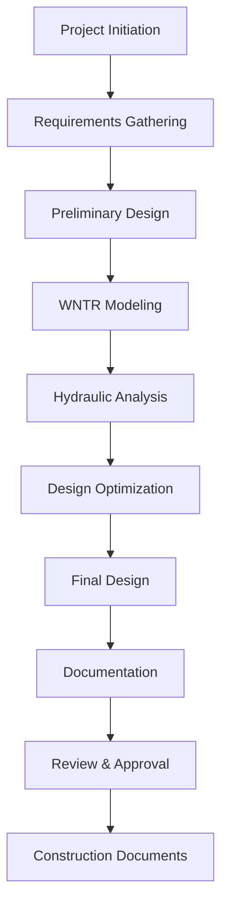

# Project Management Guide

## 📋 Overview

Boorie provides comprehensive project management tools designed specifically for hydraulic engineering workflows. This guide covers project creation, team collaboration, document management, and version control.

## 🚀 Project Creation

### 1. New Project Setup

#### Quick Start Project
```typescript
const newProject = {
  name: "Urban Water Distribution - Phase 1",
  type: "water_distribution",
  location: {
    city: "Mexico City",
    country: "Mexico",
    coordinates: [-99.1332, 19.4326]
  },
  standards: ["NOM-127-SSA1", "NOM-001-CONAGUA"],
  description: "Design and analysis of water distribution network for new residential development"
};
```

#### Project Templates

**Water Distribution System**
```json
{
  "template": "water_distribution",
  "designCriteria": {
    "minPressure": 20,          // m
    "maxPressure": 50,          // m
    "maxVelocity": 3.0,         // m/s
    "peakFactor": 2.5,
    "fireFlowDuration": 120     // minutes
  },
  "materials": ["PVC", "HDPE", "Ductile_Iron"],
  "analysisTypes": ["hydraulic", "water_quality", "energy"],
  "reportFormats": ["technical", "executive", "regulatory"]
}
```

**Wastewater Collection**
```json
{
  "template": "wastewater_collection",
  "designCriteria": {
    "minSlope": 0.5,            // %
    "maxVelocity": 5.0,         // m/s
    "minVelocity": 0.6,         // m/s
    "peakFactor": 4.0,
    "infiltration": 0.1         // L/s/km
  },
  "materials": ["PVC", "Concrete", "HDPE"],
  "analysisTypes": ["hydraulic", "capacity", "surcharge"]
}
```

**Industrial Water System**
```json
{
  "template": "industrial_water",
  "designCriteria": {
    "operatingPressure": 60,    // m
    "redundancy": "N+1",
    "efficiency": 85,           // %
    "uptime": 99.5             // %
  },
  "specialRequirements": ["process_water", "cooling_water", "fire_protection"],
  "monitoringPoints": ["pressure", "flow", "quality", "energy"]
}
```

### 2. Project Configuration

#### Basic Information
- **Project Name**: Descriptive identifier
- **Project Code**: Unique alphanumeric code
- **Client**: Organization or individual
- **Location**: Geographic information with coordinates
- **Timeline**: Start date, milestones, completion date
- **Budget**: Total budget and phase allocations

#### Technical Parameters
```typescript
interface ProjectConfig {
  units: {
    flow: 'L/s' | 'CMS' | 'GPM';
    pressure: 'm' | 'kPa' | 'psi';
    length: 'm' | 'ft';
    diameter: 'mm' | 'in';
  };
  standards: string[];
  designLife: number;        // years
  safetyFactors: {
    hydraulic: number;
    structural: number;
    seismic: number;
  };
  environmentalFactors: {
    temperature: { min: number; max: number };
    elevation: number;
    seismicZone: string;
  };
}
```

## 👥 Team Collaboration

### 1. User Roles and Permissions

#### Project Roles
```typescript
enum ProjectRole {
  OWNER = 'owner',           // Full control
  ADMIN = 'admin',           // Manage team and settings
  ENGINEER = 'engineer',     // Technical work and analysis
  VIEWER = 'viewer',         // Read-only access
  REVIEWER = 'reviewer'      // Review and comment only
}

interface UserPermissions {
  canEdit: boolean;
  canDelete: boolean;
  canInvite: boolean;
  canExport: boolean;
  canApprove: boolean;
  canViewSensitive: boolean;
}
```

#### Permission Matrix
| Action | Owner | Admin | Engineer | Reviewer | Viewer |
|--------|-------|-------|----------|----------|--------|
| View Project | ✅ | ✅ | ✅ | ✅ | ✅ |
| Edit Network | ✅ | ✅ | ✅ | ❌ | ❌ |
| Run Simulations | ✅ | ✅ | ✅ | ❌ | ❌ |
| Generate Reports | ✅ | ✅ | ✅ | ✅ | ❌ |
| Manage Team | ✅ | ✅ | ❌ | ❌ | ❌ |
| Delete Project | ✅ | ❌ | ❌ | ❌ | ❌ |
| Export Data | ✅ | ✅ | ✅ | ✅ | ❌ |

### 2. Team Management

#### Adding Team Members
```typescript
const inviteUser = async (projectId: string, email: string, role: ProjectRole) => {
  const invitation = {
    projectId,
    email,
    role,
    expiresAt: new Date(Date.now() + 7 * 24 * 60 * 60 * 1000), // 7 days
    message: "You've been invited to collaborate on this hydraulic project"
  };
  
  await sendInvitation(invitation);
  await trackEvent('team_invitation_sent', { role, projectId });
};
```

#### Team Communication
- **Comments**: Attach notes to specific components
- **Mentions**: Notify team members with @username
- **Notifications**: Real-time updates on project changes
- **Activity Feed**: Chronological project activity log

### 3. Real-time Collaboration

#### Simultaneous Editing
```typescript
interface CollaborationState {
  activeUsers: {
    userId: string;
    username: string;
    cursor: { x: number; y: number };
    selection: string[];
    lastActivity: Date;
  }[];
  locks: {
    componentId: string;
    userId: string;
    lockType: 'edit' | 'view';
    acquiredAt: Date;
  }[];
}
```

#### Conflict Resolution
- **Automatic Merging**: For non-conflicting changes
- **Manual Resolution**: When conflicts require human decision
- **Version Branching**: Create branches for experimental changes
- **Rollback**: Revert to previous stable state

## 📁 Document Management

### 1. Document Types

#### Technical Documents
- **Design Drawings**: CAD files, network schematics
- **Specifications**: Technical requirements and standards
- **Calculations**: Engineering calculations and analysis
- **Reports**: Analysis results and recommendations
- **Photos**: Site photos and equipment images

#### Regulatory Documents
- **Permits**: Construction and operating permits
- **Standards**: Applicable codes and regulations  
- **Approvals**: Government and client approvals
- **Compliance**: Audit reports and certifications

#### Project Documents
- **Contracts**: Client agreements and subcontracts
- **Schedules**: Project timelines and milestones
- **Budgets**: Cost estimates and financial tracking
- **Correspondence**: Email and meeting records

### 2. Document Organization

#### Folder Structure
```
Project Root/
├── 01-Design/
│   ├── Drawings/
│   ├── Specifications/
│   └── Calculations/
├── 02-Analysis/
│   ├── WNTR-Models/
│   ├── Simulation-Results/
│   └── Reports/
├── 03-Regulatory/
│   ├── Permits/
│   ├── Standards/
│   └── Approvals/
├── 04-Construction/
│   ├── As-Built/
│   ├── Testing/
│   └── Commissioning/
└── 05-Operations/
    ├── Manuals/
    ├── Maintenance/
    └── Training/
```

#### Metadata Management
```typescript
interface DocumentMetadata {
  title: string;
  description: string;
  category: DocumentCategory;
  tags: string[];
  version: string;
  author: string;
  reviewer?: string;
  approver?: string;
  createdAt: Date;
  modifiedAt: Date;
  status: 'draft' | 'review' | 'approved' | 'archived';
  confidentiality: 'public' | 'internal' | 'confidential';
  relatedComponents: string[];
}
```

### 3. Version Control

#### Document Versioning
```typescript
interface DocumentVersion {
  id: string;
  version: string;          // v1.0, v1.1, v2.0
  major: number;
  minor: number;
  patch: number;
  changeLog: string;
  author: string;
  approvedBy?: string;
  createdAt: Date;
  fileSize: number;
  checksum: string;
}
```

#### Change Tracking
- **Automatic Versioning**: New version on each save
- **Manual Versioning**: Explicit version creation
- **Change Comparison**: Visual diff between versions
- **Restore Points**: Rollback to any previous version

### 4. Document Processing

#### RAG Integration
```typescript
interface DocumentProcessing {
  extractText: boolean;       // OCR for images/PDFs
  generateEmbeddings: boolean; // Vector embeddings for search
  indexContent: boolean;      // Full-text search index
  extractEntities: boolean;   // Technical terms and values
  generateSummary: boolean;   // AI-generated summary
}
```

#### Content Analysis
- **Technical Term Extraction**: Identify key hydraulic parameters
- **Standard References**: Link to applicable codes and standards
- **Calculation Validation**: Verify engineering calculations
- **Consistency Checking**: Compare with project specifications

## 📊 Project Analytics

### 1. Progress Tracking

#### Key Performance Indicators
```typescript
interface ProjectKPIs {
  completion: {
    design: number;           // % complete
    analysis: number;
    documentation: number;
    approval: number;
  };
  quality: {
    reviewsPending: number;
    issuesOpen: number;
    standardsCompliance: number; // %
  };
  timeline: {
    daysRemaining: number;
    milestoneProgress: number;  // %
    criticalPath: string[];
  };
  resources: {
    budgetUsed: number;        // %
    teamUtilization: number;   // %
    toolUsage: number;         // hours
  };
}
```

#### Progress Visualization
- **Gantt Charts**: Timeline and dependency visualization
- **Burndown Charts**: Work completion over time
- **Resource Allocation**: Team member workload
- **Budget Tracking**: Actual vs. planned spending

### 2. Quality Metrics

#### Design Quality
```typescript
interface QualityMetrics {
  networkComplexity: number;     // nodes per area
  redundancy: number;            // alternative paths
  efficiency: number;            // energy per volume
  reliability: number;           // uptime percentage
  compliance: {
    standards: string[];
    violations: number;
    waivers: number;
  };
}
```

#### Analysis Quality
- **Simulation Convergence**: Percentage of successful runs
- **Results Validation**: Comparison with expected values
- **Sensitivity Analysis**: Parameter variation impact
- **Uncertainty Quantification**: Confidence intervals

### 3. Reporting and Dashboards

#### Executive Dashboard
```typescript
interface ExecutiveDashboard {
  projectHealth: 'green' | 'yellow' | 'red';
  completionDate: Date;
  budgetStatus: 'under' | 'on-track' | 'over';
  riskLevel: 'low' | 'medium' | 'high';
  keyMilestones: Milestone[];
  criticalIssues: Issue[];
  teamPerformance: TeamMetrics;
}
```

#### Technical Dashboard
- **System Performance**: Pressure, flow, efficiency metrics
- **Analysis Results**: Simulation outcomes and trends
- **Design Iterations**: Evolution of design parameters
- **Optimization Results**: Performance improvements

## 🔄 Workflow Management

### 1. Design Process

#### Typical Workflow


#### Stage Gates
```typescript
interface StageGate {
  name: string;
  criteria: {
    deliverables: string[];
    qualityChecks: string[];
    approvals: string[];
  };
  status: 'pending' | 'in-review' | 'approved' | 'rejected';
  reviewers: string[];
  deadline: Date;
}
```

### 2. Review Process

#### Review Types
- **Technical Review**: Engineering accuracy and standards compliance
- **Peer Review**: Cross-checking by other engineers
- **Client Review**: Stakeholder approval and feedback
- **Regulatory Review**: Compliance with codes and permits

#### Review Workflow
```typescript
interface ReviewProcess {
  stages: {
    submission: {
      documents: string[];
      checklist: string[];
      submitter: string;
    };
    review: {
      reviewers: string[];
      deadline: Date;
      criteria: string[];
    };
    feedback: {
      comments: Comment[];
      recommendations: string[];
      decision: 'approve' | 'revise' | 'reject';
    };
    revision: {
      changes: Change[];
      responses: string[];
      resubmission: Date;
    };
  };
}
```

### 3. Approval Management

#### Approval Hierarchy
```typescript
interface ApprovalHierarchy {
  levels: {
    technical: {
      role: 'senior_engineer';
      authority: 'technical_accuracy';
    };
    quality: {
      role: 'quality_manager';
      authority: 'standards_compliance';
    };
    project: {
      role: 'project_manager';
      authority: 'schedule_budget';
    };
    client: {
      role: 'client_representative';
      authority: 'final_approval';
    };
  };
}
```

## 📈 Advanced Features

### 1. Template Management

#### Custom Templates
```typescript
interface ProjectTemplate {
  name: string;
  category: 'water' | 'wastewater' | 'industrial';
  configuration: ProjectConfig;
  workflows: Workflow[];
  documents: DocumentTemplate[];
  calculationSets: CalculationTemplate[];
  reportFormats: ReportTemplate[];
}
```

#### Template Sharing
- **Organization Templates**: Shared within company
- **Industry Templates**: Best practices for specific sectors
- **Regional Templates**: Local standards and practices
- **Public Templates**: Open-source community templates

### 2. Integration Capabilities

#### External Systems
```typescript
interface ExternalIntegration {
  gis: {
    provider: 'ArcGIS' | 'QGIS' | 'MapInfo';
    layerSync: boolean;
    coordinateSystem: string;
  };
  cad: {
    provider: 'AutoCAD' | 'MicroStation' | 'Civil3D';
    drawingSync: boolean;
    layerMapping: Record<string, string>;
  };
  erp: {
    provider: 'SAP' | 'Oracle' | 'Custom';
    projectSync: boolean;
    costTracking: boolean;
  };
}
```

#### API Access
- **RESTful APIs**: Standard HTTP-based integration
- **GraphQL**: Flexible data querying
- **Webhooks**: Real-time event notifications
- **SDK**: Development libraries for custom applications

### 3. Automation Features

#### Automated Workflows
```typescript
interface AutomationRule {
  trigger: {
    event: 'file_upload' | 'calculation_complete' | 'review_approved';
    conditions: Record<string, any>;
  };
  actions: {
    type: 'notify' | 'generate_report' | 'run_analysis' | 'update_status';
    parameters: Record<string, any>;
  }[];
  schedule?: {
    frequency: 'daily' | 'weekly' | 'monthly';
    time: string;
  };
}
```

#### Batch Operations
- **Bulk Simulations**: Run multiple scenarios automatically
- **Report Generation**: Automated report creation
- **Data Export**: Scheduled data exports
- **Notification Campaigns**: Automated team updates

## 🔒 Security and Compliance

### 1. Data Security

#### Access Controls
```typescript
interface SecurityControls {
  authentication: {
    method: 'password' | 'sso' | 'mfa';
    sessionTimeout: number;
    passwordPolicy: PasswordPolicy;
  };
  authorization: {
    roleBasedAccess: boolean;
    attributeBasedAccess: boolean;
    dataClassification: boolean;
  };
  encryption: {
    atRest: boolean;
    inTransit: boolean;
    keyManagement: 'internal' | 'external';
  };
}
```

#### Audit Trail
- **User Activities**: All user actions logged
- **Data Changes**: Complete change history
- **System Events**: Security and performance events
- **Compliance Reports**: Regulatory audit trails

### 2. Backup and Recovery

#### Backup Strategy
```typescript
interface BackupStrategy {
  frequency: 'realtime' | 'hourly' | 'daily' | 'weekly';
  retention: {
    daily: number;    // days
    weekly: number;   // weeks
    monthly: number;  // months
    yearly: number;   // years
  };
  storage: {
    local: boolean;
    cloud: boolean;
    offsite: boolean;
  };
  encryption: boolean;
  testing: {
    frequency: 'monthly' | 'quarterly';
    lastTest: Date;
    success: boolean;
  };
}
```

#### Disaster Recovery
- **Recovery Time Objective (RTO)**: 4 hours
- **Recovery Point Objective (RPO)**: 1 hour
- **Backup Verification**: Automated integrity checks
- **Failover Procedures**: Documented recovery steps

---

**Next Steps**: Explore [Engineering Calculations](Engineering-Calculations.md) for detailed technical calculation workflows within projects.