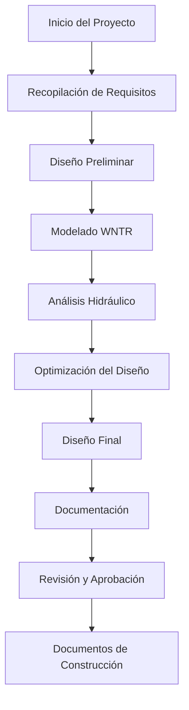

# Guía de Gestión de Proyectos

## Descripción General

Boorie proporciona herramientas completas de gestión de proyectos diseñadas específicamente para flujos de trabajo de ingeniería hidráulica. Esta guía cubre la creación de proyectos, colaboración en equipo, gestión de documentos y control de versiones.

## Creación de Proyectos

### 1. Configuración de Nuevo Proyecto

#### Proyecto de Inicio Rápido
```typescript
const newProject = {
  name: "Distribución Urbana de Agua - Fase 1",
  type: "water_distribution",
  location: {
    city: "Ciudad de México",
    country: "México",
    coordinates: [-99.1332, 19.4326]
  },
  standards: ["NOM-127-SSA1", "NOM-001-CONAGUA"],
  description: "Diseño y análisis de red de distribución de agua para nuevo desarrollo residencial"
};
```

#### Plantillas de Proyecto

**Sistema de Distribución de Agua**
```json
{
  "template": "water_distribution",
  "designCriteria": {
    "minPressure": 20,          // m
    "maxPressure": 50,          // m
    "maxVelocity": 3.0,         // m/s
    "peakFactor": 2.5,
    "fireFlowDuration": 120     // minutos
  },
  "materials": ["PVC", "HDPE", "Ductile_Iron"],
  "analysisTypes": ["hydraulic", "water_quality", "energy"],
  "reportFormats": ["technical", "executive", "regulatory"]
}
```

**Recolección de Aguas Residuales**
```json
{
  "template": "wastewater_collection",
  "designCriteria": {
    "minSlope": 0.5,            // %
    "maxVelocity": 5.0,         // m/s
    "minVelocity": 0.6,         // m/s
    "peakFactor": 4.0,
    "infiltration": 0.1         // L/s/km
  },
  "materials": ["PVC", "Concrete", "HDPE"],
  "analysisTypes": ["hydraulic", "capacity", "surcharge"]
}
```

**Sistema de Agua Industrial**
```json
{
  "template": "industrial_water",
  "designCriteria": {
    "operatingPressure": 60,    // m
    "redundancy": "N+1",
    "efficiency": 85,           // %
    "uptime": 99.5             // %
  },
  "specialRequirements": ["process_water", "cooling_water", "fire_protection"],
  "monitoringPoints": ["pressure", "flow", "quality", "energy"]
}
```

### 2. Configuración del Proyecto

#### Información Básica
- **Nombre del Proyecto**: Identificador descriptivo
- **Código del Proyecto**: Código alfanumérico único
- **Cliente**: Organización o individuo
- **Ubicación**: Información geográfica con coordenadas
- **Cronograma**: Fecha de inicio, hitos, fecha de finalización
- **Presupuesto**: Presupuesto total y asignaciones por fase

#### Parámetros Técnicos
```typescript
interface ProjectConfig {
  units: {
    flow: 'L/s' | 'CMS' | 'GPM';
    pressure: 'm' | 'kPa' | 'psi';
    length: 'm' | 'ft';
    diameter: 'mm' | 'in';
  };
  standards: string[];
  designLife: number;        // años
  safetyFactors: {
    hydraulic: number;
    structural: number;
    seismic: number;
  };
  environmentalFactors: {
    temperature: { min: number; max: number };
    elevation: number;
    seismicZone: string;
  };
}
```

## Colaboración en Equipo

### 1. Roles de Usuario y Permisos

#### Roles del Proyecto
```typescript
enum ProjectRole {
  OWNER = 'owner',           // Control total
  ADMIN = 'admin',           // Gestionar equipo y ajustes
  ENGINEER = 'engineer',     // Trabajo técnico y análisis
  VIEWER = 'viewer',         // Acceso de solo lectura
  REVIEWER = 'reviewer'      // Solo revisión y comentarios
}
```

#### Matriz de Permisos
| Acción | Propietario | Admin | Ingeniero | Revisor | Visor |
|--------|-------------|-------|-----------|---------|-------|
| Ver Proyecto | Si | Si | Si | Si | Si |
| Editar Red | Si | Si | Si | No | No |
| Ejecutar Simulaciones | Si | Si | Si | No | No |
| Generar Informes | Si | Si | Si | Si | No |
| Gestionar Equipo | Si | Si | No | No | No |
| Eliminar Proyecto | Si | No | No | No | No |
| Exportar Datos | Si | Si | Si | Si | No |

### 2. Gestión de Equipo

#### Añadir Miembros del Equipo
```typescript
const inviteUser = async (projectId: string, email: string, role: ProjectRole) => {
  const invitation = {
    projectId,
    email,
    role,
    expiresAt: new Date(Date.now() + 7 * 24 * 60 * 60 * 1000), // 7 días
    message: "Has sido invitado a colaborar en este proyecto hidráulico"
  };

  await sendInvitation(invitation);
  await trackEvent('team_invitation_sent', { role, projectId });
};
```

#### Comunicación del Equipo
- **Comentarios**: Adjuntar notas a componentes específicos
- **Menciones**: Notificar a miembros del equipo con @usuario
- **Notificaciones**: Actualizaciones en tiempo real sobre cambios del proyecto
- **Feed de Actividad**: Registro cronológico de actividad del proyecto

### 3. Colaboración en Tiempo Real

#### Edición Simultánea
```typescript
interface CollaborationState {
  activeUsers: {
    userId: string;
    username: string;
    cursor: { x: number; y: number };
    selection: string[];
    lastActivity: Date;
  }[];
  locks: {
    componentId: string;
    userId: string;
    lockType: 'edit' | 'view';
    acquiredAt: Date;
  }[];
}
```

#### Resolución de Conflictos
- **Fusión Automática**: Para cambios no conflictivos
- **Resolución Manual**: Cuando los conflictos requieren decisión humana
- **Ramificación de Versiones**: Crear ramas para cambios experimentales
- **Reversión**: Volver al estado estable anterior

## Gestión de Documentos

### 1. Tipos de Documentos

#### Documentos Técnicos
- **Planos de Diseño**: Archivos CAD, esquemáticos de red
- **Especificaciones**: Requisitos técnicos y estándares
- **Cálculos**: Cálculos y análisis de ingeniería
- **Informes**: Resultados de análisis y recomendaciones
- **Fotos**: Fotos del sitio e imágenes de equipos

#### Documentos Regulatorios
- **Permisos**: Permisos de construcción y operación
- **Estándares**: Códigos y regulaciones aplicables
- **Aprobaciones**: Aprobaciones gubernamentales y del cliente
- **Cumplimiento**: Informes de auditoría y certificaciones

#### Documentos del Proyecto
- **Contratos**: Acuerdos con clientes y subcontratos
- **Cronogramas**: Líneas de tiempo y hitos del proyecto
- **Presupuestos**: Estimaciones de costos y seguimiento financiero
- **Correspondencia**: Registros de email y reuniones

### 2. Organización de Documentos

#### Estructura de Carpetas
```
Raíz del Proyecto/
├── 01-Diseño/
│   ├── Planos/
│   ├── Especificaciones/
│   └── Cálculos/
├── 02-Análisis/
│   ├── Modelos-WNTR/
│   ├── Resultados-Simulación/
│   └── Informes/
├── 03-Regulatorio/
│   ├── Permisos/
│   ├── Estándares/
│   └── Aprobaciones/
├── 04-Construcción/
│   ├── As-Built/
│   ├── Pruebas/
│   └── Puesta-en-Marcha/
└── 05-Operaciones/
    ├── Manuales/
    ├── Mantenimiento/
    └── Capacitación/
```

### 3. Control de Versiones

#### Versionado de Documentos
```typescript
interface DocumentVersion {
  id: string;
  version: string;          // v1.0, v1.1, v2.0
  major: number;
  minor: number;
  patch: number;
  changeLog: string;
  author: string;
  approvedBy?: string;
  createdAt: Date;
  fileSize: number;
  checksum: string;
}
```

#### Seguimiento de Cambios
- **Versionado Automático**: Nueva versión en cada guardado
- **Versionado Manual**: Creación explícita de versiones
- **Comparación de Cambios**: Diferencias visuales entre versiones
- **Puntos de Restauración**: Reversión a cualquier versión anterior

### 4. Procesamiento de Documentos

#### Integración RAG
```typescript
interface DocumentProcessing {
  extractText: boolean;       // OCR para imágenes/PDFs
  generateEmbeddings: boolean; // Vectores de embedding para búsqueda
  indexContent: boolean;      // Índice de búsqueda de texto completo
  extractEntities: boolean;   // Términos técnicos y valores
  generateSummary: boolean;   // Resumen generado por AI
}
```

#### Análisis de Contenido
- **Extracción de Términos Técnicos**: Identificar parámetros hidráulicos clave
- **Referencias de Estándares**: Vincular a códigos y estándares aplicables
- **Validación de Cálculos**: Verificar cálculos de ingeniería
- **Verificación de Consistencia**: Comparar con especificaciones del proyecto

## Analíticas del Proyecto

### 1. Seguimiento de Progreso

#### Indicadores Clave de Rendimiento
```typescript
interface ProjectKPIs {
  completion: {
    design: number;           // % completo
    analysis: number;
    documentation: number;
    approval: number;
  };
  quality: {
    reviewsPending: number;
    issuesOpen: number;
    standardsCompliance: number; // %
  };
  timeline: {
    daysRemaining: number;
    milestoneProgress: number;  // %
    criticalPath: string[];
  };
  resources: {
    budgetUsed: number;        // %
    teamUtilization: number;   // %
    toolUsage: number;         // horas
  };
}
```

#### Visualización de Progreso
- **Diagramas de Gantt**: Visualización de cronograma y dependencias
- **Gráficos de Burndown**: Finalización de trabajo a lo largo del tiempo
- **Asignación de Recursos**: Carga de trabajo de miembros del equipo
- **Seguimiento de Presupuesto**: Gasto real vs. planificado

### 2. Métricas de Calidad

#### Calidad de Diseño
```typescript
interface QualityMetrics {
  networkComplexity: number;     // nodos por área
  redundancy: number;            // rutas alternativas
  efficiency: number;            // energía por volumen
  reliability: number;           // porcentaje de disponibilidad
  compliance: {
    standards: string[];
    violations: number;
    waivers: number;
  };
}
```

## Gestión de Flujos de Trabajo

### 1. Proceso de Diseño

#### Flujo de Trabajo Típico


### 2. Proceso de Revisión

#### Tipos de Revisión
- **Revisión Técnica**: Precisión de ingeniería y cumplimiento de estándares
- **Revisión por Pares**: Verificación cruzada por otros ingenieros
- **Revisión del Cliente**: Aprobación y retroalimentación del interesado
- **Revisión Regulatoria**: Cumplimiento de códigos y permisos

## Funciones Avanzadas

### 1. Gestión de Plantillas

#### Compartición de Plantillas
- **Plantillas Organizacionales**: Compartidas dentro de la empresa
- **Plantillas de la Industria**: Mejores prácticas para sectores específicos
- **Plantillas Regionales**: Estándares y prácticas locales
- **Plantillas Públicas**: Plantillas de la comunidad de código abierto

### 2. Capacidades de Integración

#### Sistemas Externos
```typescript
interface ExternalIntegration {
  gis: {
    provider: 'ArcGIS' | 'QGIS' | 'MapInfo';
    layerSync: boolean;
    coordinateSystem: string;
  };
  cad: {
    provider: 'AutoCAD' | 'MicroStation' | 'Civil3D';
    drawingSync: boolean;
    layerMapping: Record<string, string>;
  };
  erp: {
    provider: 'SAP' | 'Oracle' | 'Custom';
    projectSync: boolean;
    costTracking: boolean;
  };
}
```

### 3. Funciones de Automatización

#### Flujos de Trabajo Automatizados
```typescript
interface AutomationRule {
  trigger: {
    event: 'file_upload' | 'calculation_complete' | 'review_approved';
    conditions: Record<string, any>;
  };
  actions: {
    type: 'notify' | 'generate_report' | 'run_analysis' | 'update_status';
    parameters: Record<string, any>;
  }[];
}
```

#### Operaciones por Lotes
- **Simulaciones Masivas**: Ejecutar múltiples escenarios automáticamente
- **Generación de Informes**: Creación automatizada de informes
- **Exportación de Datos**: Exportaciones de datos programadas
- **Campañas de Notificación**: Actualizaciones automatizadas del equipo

## Seguridad y Cumplimiento

### 1. Seguridad de Datos

#### Controles de Acceso
```typescript
interface SecurityControls {
  authentication: {
    method: 'password' | 'sso' | 'mfa';
    sessionTimeout: number;
    passwordPolicy: PasswordPolicy;
  };
  authorization: {
    roleBasedAccess: boolean;
    attributeBasedAccess: boolean;
    dataClassification: boolean;
  };
  encryption: {
    atRest: boolean;
    inTransit: boolean;
    keyManagement: 'internal' | 'external';
  };
}
```

### 2. Respaldo y Recuperación

#### Estrategia de Respaldo
```typescript
interface BackupStrategy {
  frequency: 'realtime' | 'hourly' | 'daily' | 'weekly';
  retention: {
    daily: number;    // días
    weekly: number;   // semanas
    monthly: number;  // meses
    yearly: number;   // años
  };
  storage: {
    local: boolean;
    cloud: boolean;
    offsite: boolean;
  };
  encryption: boolean;
}
```

#### Recuperación ante Desastres
- **Objetivo de Tiempo de Recuperación (RTO)**: 4 horas
- **Objetivo de Punto de Recuperación (RPO)**: 1 hora
- **Verificación de Respaldo**: Verificaciones automáticas de integridad
- **Procedimientos de Failover**: Pasos de recuperación documentados

---

**Próximos Pasos**: Explora [Cálculos de Ingeniería](Calculos-Ingenieria.md) para flujos de trabajo detallados de cálculos técnicos dentro de proyectos.
